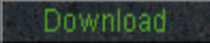
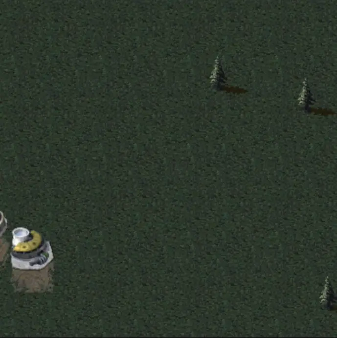
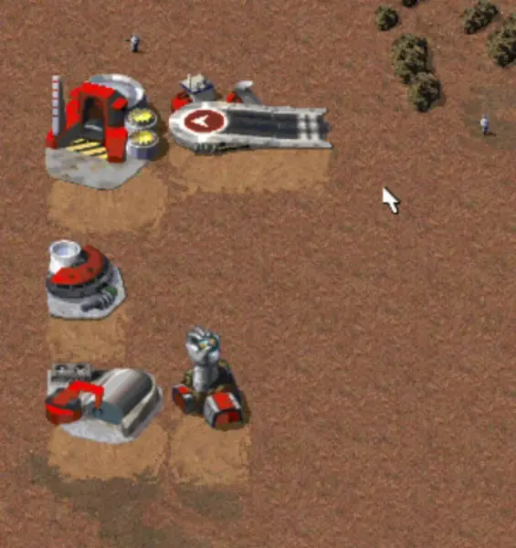
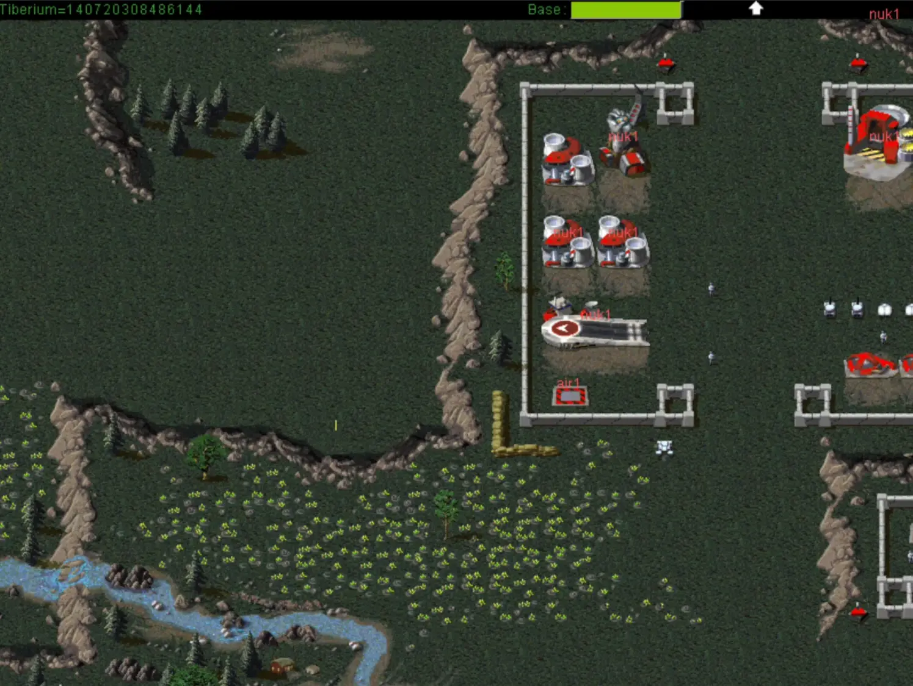
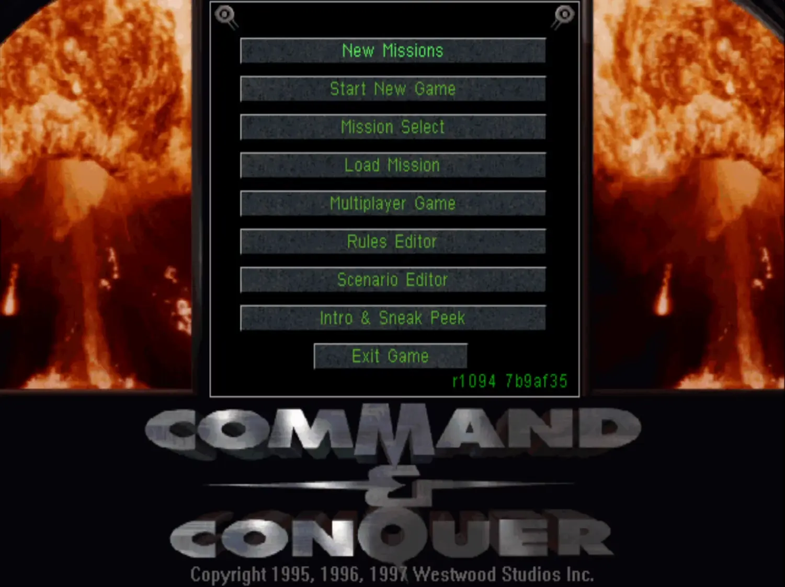
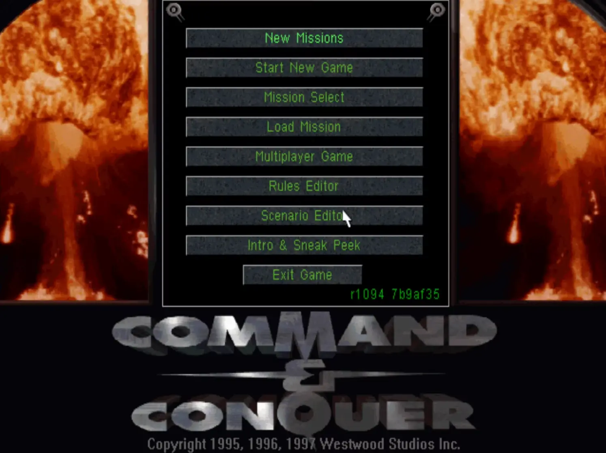
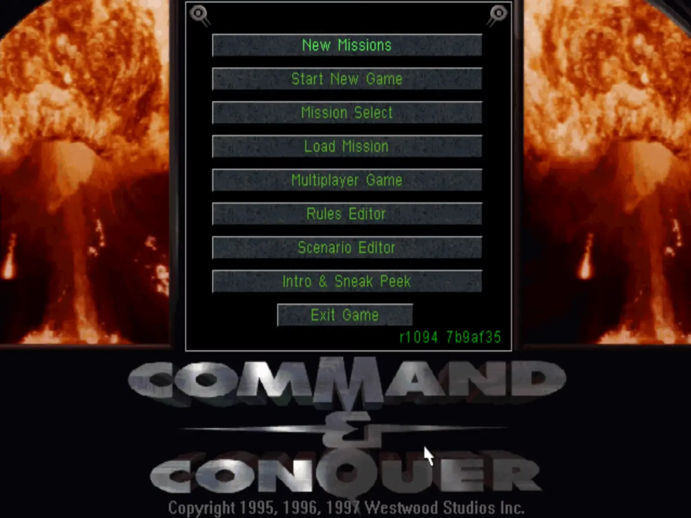
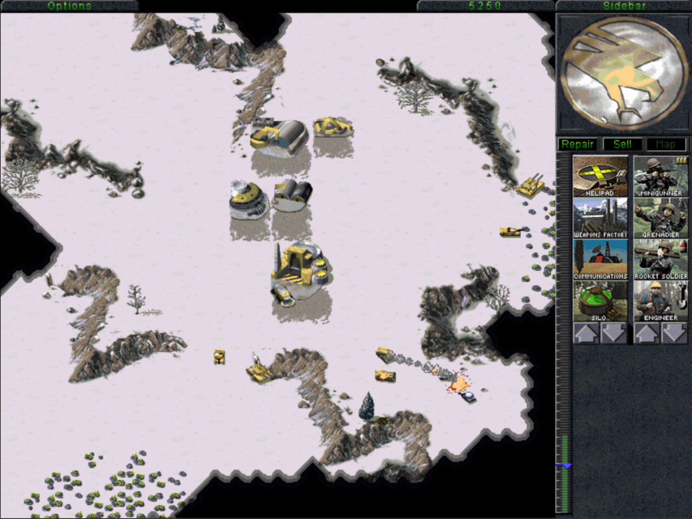

  <h1>🛠 New Construction Options 🛠</h1>
  
  

    
  

  

C&C: New Construction Options (NCO) is a cross-platform, enhanced version of `Command & Conquer: Tiberian Dawn` & `Command & Conquer: Red Alert`. It's goals are to enhance the gameplay and modding experience.

This project aims to provide an out-of-the-box experience that looks and feels like the original games while giving users extensive modding control and enhancements through in-game menus, with full INI file configuration and Lua scripting.

NCO is also available as a mod for Command & Conquer: Remastered Collection, both for Tiberian Dawn and Red Alert.

> This project is a fork of [Vanilla Conquer](https://github.com/TheAssemblyArmada/Vanilla-Conquer) 

## Tiberian Dawn Showcase

<table>
    <tr>
        <th>
            
Native High Resolution Support

            
        </th>
        <th>
            
Modern Wall Building

            
        </th>
    </tr>
    <tr>
        <th>
            
Rally Points

            
        </th>
        <th>
            
Scenario Editor

            
        </th>
    </tr>
    <tr>
        <th>
            
Rules Editor

            
        </th>
        <th>
            
Mission Select Menu

            
        </th>
    </tr>
    <tr>
        <th>
            
Improved Skirmish Setup

            
        </th>
        <th>
            
Snow Theater

            
        </th>
    </tr>
</table>

## Red Alert Showcase

<table>
    <tr>
        <th>
            
Native High Resolution Support

            
        </th>
        <th>
            
The Lost Files (Mod Support)

            
        </th>
    </tr>
</table>

## Download

NCO provides a Launcher app for Windows, Linux and macOS. It will install NCO and download required files from the freeware releases of the original games.

Grab the latest launcher for your system [here](https://github.com/djfdyuruiry/cnc-new-construction-options/releases/tag/latest)

Full launcher guide can be found [here](https://github.com/djfdyuruiry/cnc-new-construction-options/wiki/1.Launcher)

### Remastered Collection

NCO can be installed as a mod for the Remastered Collection, follow the steps [here](https://github.com/djfdyuruiry/cnc-new-construction-options/wiki/1a.Install-Remaster-Mod)

---

### [> Enhancements List](https://github.com/djfdyuruiry/cnc-new-construction-options/wiki/2.Enhancements)
### [> Project Wiki](https://github.com/djfdyuruiry/cnc-new-construction-options/wiki)
### [> Planned Features](https://github.com/djfdyuruiry/cnc-new-construction-options/wiki/4.Planned-Features)

## ⚠ Under Construction ⚠

**EVA: "BUILDING"**

This project is under construction and heavy development, so features might change and things may not work as expected - please report any bugs/ideas to the Issues section of this repo.

Always check the enhancements list as it will show which features are still in alpha/beta.

## Note on GitHub Forks

> _I removed this repo from the `Vanilla Conquer` network as GitHub defaults PRs for this repo to the upstream of the fork, which is annoying. This is the only reason I don't have the fork link in place currently. I will move it back into the network when GitHub allows setting the default base repo for all new PRs._

## License

This project is licensed under the GPLv3 license. See the [License.txt](License.txt) file for details.
