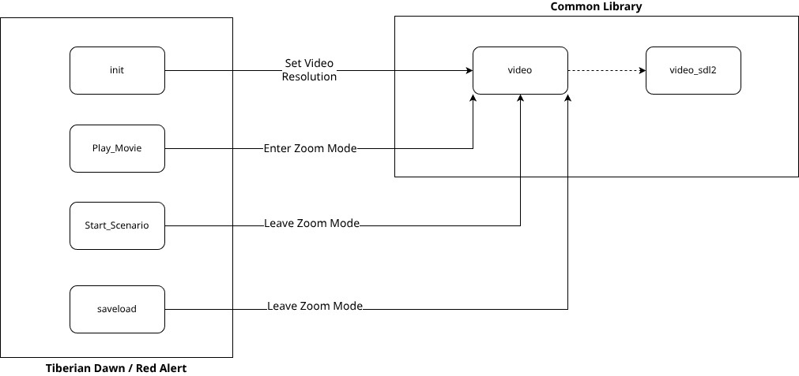

# Hi-Resolution Support Documentation

This is the complete documentation for high resolution support added to the NCO Command & Conquer engine, allowing running Tiberian Dawn and Red Alert at resolutions higher than 640x400.

## Background

- The original DOS C&C ran at 320x200 (and the DOS version of Red Alert)
- C&C Gold and Red Alert 95 ran at double that, 640x400 stretched to 640x480
- Movies, animations and menu background are loaded in at 640x400 
- Most assets are either 640x400 or interpolated/scaled 320x200 (movies, animations etc.)

## Video Backend

> Hi-resolution support targets the SDL2 video backend only, DirectX and SDL1 builds just have a stub implementation that does nothing.

- SDL2 backend of Vanilla Conquer either rendered DOS mode (320x200) or the default resolution, it then scaled this up to match the INI config width and height or defaulted to fullscreen, using the current desktop resolution
- This has been updated to accept any in-game resolution, but still scale that resolution to fullscreen borderless or a standalone window
- `StretchWidth` and `StretchHeight` settings have been added to allow setting the scaled resolution for windowed/fullscreen 
- Functions added to enter/leave a 'zoom' mode allow cropping output to 640x400 and scaling that up, to support screens with fixed layouts and graphics

See: [video_sdl2.cpp](../../common/video_sdl2.cpp) and [video.h](../../common/video.h)

The below diagram shows how the video backend is used from Tiberian Dawn/Red Alert:

### Resolution Modes

Internally the SDL2 backend uses an enum to set the 'mode' which drives how then window is initialized and resolution configured:

- The game engine can set the mode to `MODE_HIGH_RES`, this enables hi-res and 'zooming' in and out of 640x400
- `MODE_ZOOM` mode is used to signal that SDL2 should crop the game to this resolution when rendering frames
- The `Enter_Zoomed_Resolution_Mode` and `Leave_Zoomed_Resolution_Mode` functions trigger the change in mode
- For code that needs to determine the current displayed ares (Zoomed or full) the `Try_Get_Resolution_Mode_Width` and `Try_Get_Resolution_Mode_Height` return either the zoomed resolution or full resolution dependent on the current mode

See: `ResolutionMode` in [video.h](../../common/video.h)

## Tiberian Dawn

Resolution settings are stored in `CONQUER.INI` and loaded on startup, the `Resolve_Resolution_Mode` function in [startup.cpp](../../tiberiandawn/startup.cpp) determines the mode to use.

Only the scenario view is true hi-res, that is the in-game screen with the map and sidebar. Briefings and dialog
boxes (Options menu etc.) in-game are also hi-res.

### Scenario View

- The sidebar logic was reworked to use relative co-ordinates, anchoring all controls to the top-right hand side of the screen
  - Radar and Factory Strips resolution are unchanged
  - Power strip logic has been updated to dynamically fill the entire height on the screen and scale meter to display (see tiberiandawn/power.cpp ::Draw_It())
  - A background texture is rendered below the Factory Strips to fill the empty space between them and the bottom of the screen
- Maps that are smaller than the current resolution can cause some problems but several changes were added to mitigate this:
  - All cells and objects outside the intended map size (set in scenario INI) are never rendered
  - Black rectangles are added on sides of the map to prevent artifacts from units at the edges of the map (which may be right of the map or below the map or both)
  - When a scenario like this is started/restarted or loaded from a save, the map view dimensions are refreshed to ensure it is displayed correctly before render
- Save/load functionality was updated to ensure that the `TabClass::One_Time` method and base methods are called to refresh resolution dependant fields

### Sidebar Background

- The `BTEXTURE.SHP` shape is used as a texture in the background of menus throughout the game
- We tile this shape below the Factory Strips using the `Texture` class as a wrapper to cache the texture shape
- `MenuFillTexture` and `InGameFillTexture` globals are available so the textures are cached for the menu systems as well

### Power Strip

- Tiberian dawn uses the `HPWRBAR.SHP` shape to render the power strip
- It contains 100 pixel tall cropped versions for partially drawing the bar and colored versions as well for low/high power
- We use the shape for the bottom of the sidebar to draw 'segments' by drawing the top 10 pixels of the image over and over again
- Since subsequent drawing operations draw over old pixels, this can be used to 'paste' as many segments as are needed to fill the screen
- The full sidebar bottom shape is also drawn in full at the bottom of the screen, with correct end margin graphic
- A similar technique is used to fill the bar with colour, but this uses a clipping window so only the appropriate power height is rendered (amount of power)

### CPS Images

At various points static graphics in CPS format are rendered to the screen, internally C&C scales these up from the original DOS resolution to 640x400. This has been updated to scale them up to whatever the current in-game resolution is.

Interactive menus using CPS images are still 'zoomed' in to 640x400.

### Known issues

- Need to review FROM_JSON methods to ensure that any calculated constants or variables tied to game resolution are refreshed on save load (calling One_Time with a flag to partially reset object)
  - I have added ` // TODO: Remove and test, as it is calculated from resolution` to fields of interest
  - For now, the `TabClass::One_Time` call in `FROM_JSON` functions should reset any incorrect field values

## Red Alert

Resolution settings are stored in `REDALERT.INI` and loaded on startup, the `Resolve_Resolution_Mode` function in [startup.cpp](../../redalert/startup.cpp) determines the mode to use.

Only the scenario view is true hi-res, that is the in-game screen with the map and sidebar. Briefings and dialog
boxes (Options menu etc.) in-game are also hi-res.

### Scenario View

- The sidebar logic was reworked to use relative co-ordinates, anchoring all controls to the top-right hand side of the screen
  - Radar and Factory Strips resolution are unchanged
  - Power strip logic has been updated to dynamically fill the entire height on the screen and scale meter to display (see redalert/power.cpp ::Draw_It())
  - A background texture is rendered below the Factory Strips to fill the empty space between them and the bottom of the screen
- Maps that are smaller than the current resolution can cause some problems but several changes were added to mitigate this:
  - All cells and objects outside the intended map size (set in scenario INI) are never rendered
  - Black rectangles are added on sides of the map to prevent artifacts from units at the edges of the map (which may be right of the map or below the map or both)
  - When a scenario like this is started/restarted or loaded from a save, the map view dimensions are refreshed to ensure it is displayed correctly before render
- Save/load functionality was updated to ensure that the `SidebarClass::One_Time` method and base methods are called to refresh resolution dependant fields

### Sidebar Background

- Red alert uses `DD-TOP.SHP` as a seperator graphic between the Factory Strips and the background, this is resued from menu borders
- The `DD-BKGND.SHP` shape is also used in the menus throughout the game
- We tile the top left and bottom left images from this shape below the Factory Strips
- This is looped until the screen height has been filled (seperator -> tiled background images -> repeat)

### Power Strip

- Red alert uses the `POWERBAR.SHP` shape to render the power strip
- It contains two 112 pixel tall segments for drawing the full strip
- We draw the first shape as normal to render the top graphics
- We then use the second (bottom) shape to draw 'segments' by drawing the top 8 pixels of the image over and over again
- Since subsequent drawing operations draw over old pixels, this can be used to 'paste' as many segments as are needed to fill the screen
- The full sidebar bottom shape is drawn at the end to anchor it to the end of the screen
- Sidebar fill is done using a simple coloured rectangle, we have updated the rectangle dimensions calculation to work correctly with any screen height

> NOTE: Unlike Tiberian Dawn, both the top and bottom sidebar segments have unique graphics at the top and bottom respectively, and the 'ticks' in the images curve at the top/bottom of the bar graphic

### PCX Images

At various points static graphics in PCX format are rendered to the screen, these are hardcoded to 640x400. The game now renders these graphics in the center of the screen, filling in areas around the outside in black.
