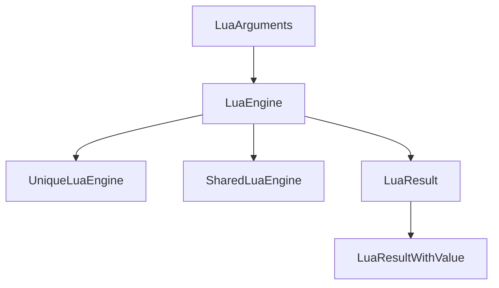

# LuaEngine Class

The `LuaEngine` is an abstract base class that provides core functionality for interacting with Lua scripts from C++. It serves as the foundation for all Lua interactions in this system.

## Core Features

### State Management
- Access to Lua state through virtual methods
- Thread-safe execution contexts
- Stack management operations

### Execution Capabilities
- Synchronous script execution (`Exec`, `Exec_File)
- Asynchronous script execution (`Exec_Async`, `Exec_File_Async`)
- Lua function execution (`PCall_With_Args`)

### Value Handling
- Type-safe value reading with type checking (`Try_Read`, `Try_Read_Table_Field`)
- Stack manipulation (`Push_Value`, `Pop`)
- Type conversion utilities

## Usage Examples

### Executing Lua Scripts
```c++
LuaEngine engine = UniqueLuaEngine();
auto result = engine.Exec("print('Hello from C++')");

if (result.Is_Ok()) {
    // Script executed successfully
} else {
    // Handle error
    std::cout << "Error: " << result.Error_Message() << std::endl;
}
```

### Reading Values from Stack
```c++
auto result = engine.Exec("return 42");
auto value = result.Try_Read<int>();

if (value.Has_Value()) {
    int actual_value = value.Unpack();
    // Use actual_value
}
```

## Class Hierarchy

The `LuaEngine` forms the base of a class hierarchy:



## Protected Methods

- `Get_State()` - Virtual method to provide access to the underlying Lua state
- `With_State()` - Execute actions with the Lua state context
- `Get_Value_From_State()` - Generic getter for state values

## Public Interface

### Execution Methods
- `Exec(const std::string& script)` - Execute a Lua script string
- `Exec_Async(const std::string& script)` - Asynchronous execution
- `Exec_File(std::filesystem::path script_path)` - Execute a file from disk
- `Exec_File_Async(std::string_view script_path)` - Async of the above
- `Exec_File_If_Exists(std::filesystem::path script_path)` - Tries to execute file but returns OK LuaResult if it doesn't exist (useful for optional scrips)
- `Eval(const std::string& expression)` - evaluate a Lua expression (single line)
- `Eval_Async(const std::string& expression)` - Async of the above
- `PCall_With_Args()` - Call a function with arguments (must be loaded onto Lua stack first)

### Stack Operations
- `Push_Value()` - Push a value onto the stack
- `Pop()` - Pop values from the stack
- `Try_Read()` - Read and type-check a value
- `Try_Read_Variant()` - Read value as `LuaVariant` when you don't the type or multiple types are expected (use `std::get<T>(...)` to read variant value)
- `Is_Type()` - Check stack value types
- `With_Table_Field(...)` - Access values inside a table loaded onto the Lua stack
- `With_Global(...)`- Access global value (nested calls to `Load_Table(...)` and `With_Table_Field(...)` can be used to access tables and fields of global tables)

### Error Handling
- `Raise_Error()` - Raise a Lua error with message
- `Raise_Error_Format()` - Format and raise error
- `With_State()` - Execute with state context

## Implementation Notes

The `LuaEngine` class is designed to be extended by concrete implementations:

1. **UniqueLuaEngine** - For context-specific engines
2. **SharedLuaEngine** - For shared contexts

All derived classes must implement the pure virtual method `Get_State()`.

### Type Safety

`std::variant` and `concept` are used for type safety, so that values read from and written to the Lua engine are restricted to those with implemented logic.

- `LuaVariant` defines the supported primitives that can be read (pulled) from the Lua stack (not table, function, nil etc. - there are dedicated methods to work with these)
- `LuaVariantCompatible` enforces that types used in generic methods that read from the Lua stack are compatible with `LuaVariant`
- `LuaPushType` defines the supported primitives that can be written (pushed) to the Lua stack (again - not table, function, nil etc. - there are dedicated methods to work with these)

These are also used in `LuaArguments` and `LuaResult` classes to extend the type safety across the API interface.
