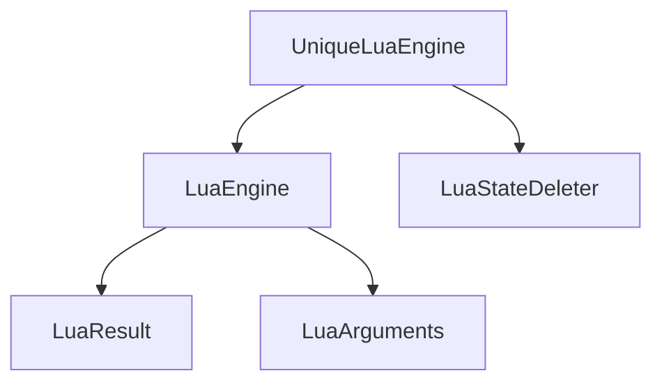

# UniqueLuaEngine Class

`UniqueLuaEngine` provides context-specific Lua engine instances that ensure clean state when starting a new context. It's designed to be used in scenarios where each context needs its own isolated Lua environment.

## Key Features

### Context Isolation
- Each instance manages its own Lua state
- Ensures clean state for new contexts (scenario, screen, thread, etc.)
- Uses smart pointer unique logic for automatic cleanup

### State Management
- Automatically handles Lua state lifecycle
- Provides persistent global state through `Global()` method
- Manages package paths with proper Lua conventions

## Usage Examples

### Creating a Unique Engine
```cpp
// Create a new unique engine instance
UniqueLuaEngine engine = UniqueLuaEngine();

// Execute Lua code
auto result = engine.Exec("print('Hello World')");

if (result.Is_Ok()) {
    // Handle success
}


```

### Using Global Engine
```cpp
// Access the global engine for persistent state (not shared or accessible from unique engine instance states)
const auto& global_engine = UniqueLuaEngine::Global();
global_engine.Eval<int>("return 42");
	.If_Value([](auto value){ // you can use fluent calls to handle result
	  // process value
	})
	.On_Error([](auto& r) {
		std::cout << r.Error_Message();
	});
```

## Architecture

### Class Relationships



## Implementation Details

### Construction
- Automatically calls `Build_State()` to create new Lua state
- Initializes package paths with custom Lua conventions
- Sets up the package.path to include project-specific paths

### State Management
- Uses `std::unique_ptr<lua_State, LuaStateDeleter>` for automatic cleanup
- Implements virtual `Get_State()` method to provide access to Lua state
- Ensures proper Lua state cleanup when engine is destroyed

## Public Methods

### Global Access
- `Global()` - Get the global unique engine instance

### State Operations
- `Build_State()` - Create a new Lua state with standard libraries
- `Get_State()` - Override for accessing Lua state

## Important Notes

- Unique engines are designed to be created for the lifecycle of a given context
- They ensure clean state when starting a new context
- Global engine should be used for persistent state requirements
