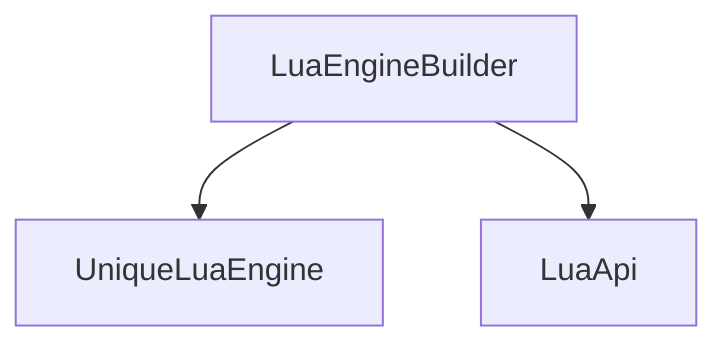

# LuaEngineBuilder Class

`LuaEngineBuilder` is a fluent builder that simplifies the registration of APIs for Lua engines. It provides a clean interface for configuring and constructing Lua engine instances.

## Purpose

The builder pattern allows developers to:
- Register multiple APIs in a fluent manner
- Configure engine properties before construction
- Reduce boilerplate code for API registration

## Key Features

### Fluent Interface
- Chainable method calls
- Type-safe API registration
- Builder pattern for configuration

### API Registration
- Register APIs with proper type checking
- Support for different API types and configurations

## Usage Examples

### Building a Lua Engine with APIs
```c++
auto engine = LuaEngineBuilder<UniqueLuaEngine>()
    .With_Api<SystemLuaApi>()
    .With_Api<GraphicsLuaApi>()
    .Build();

// Now use engine with registered APIs
```

### Builder Pattern
```c++
auto builder = LuaEngineBuilder<UniqueLuaEngine>();

// Configure the builder
builder.With_Api<SystemLuaApi>()
       .With_Api<GraphicsLuaApi>();

// Build and return engine
auto engine = builder.Build();
```

## Architecture

### Class Relationships



## Implementation Details

### Template Design
- Template parameter `T` for the engine type to build
- Uses `LuaApiConcept` concept for type constraints
- Provides compile-time checks for API registration

### Method Chaining
- Methods return reference to builder (`*this`)
- Enables fluent method chaining
- Maintains type safety throughout configuration

## Public Interface

### Builder Operations
- `With_Api()` - Register an API with the engine
- `Build()` - Resolve the end of the builder chain as a concrete implementation

## Template Requirements

The `LuaEngineBuilder` requires:
1. A class type that satisfies `LuaApiConcept`
2. Proper API registration mechanisms
3. Compatible engine types

## Important Notes

- Builder pattern is designed for configuration before construction
- Provides compile-time type checking
- Reduces complexity in API registration
