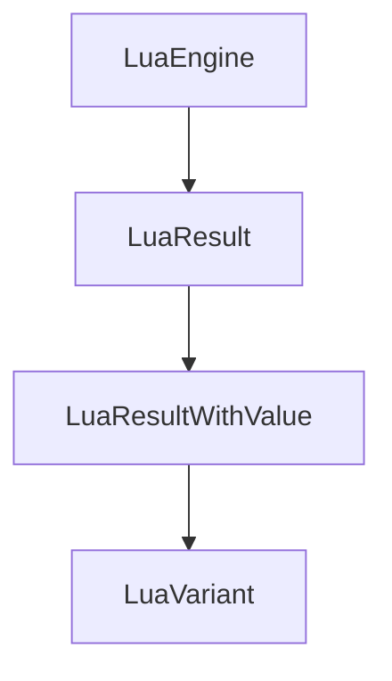

# LuaResult and LuaResultWithValue Classes

The `LuaResult` classes provide type-safe error handling for Lua script execution results. They encapsulate both success and error states with appropriate value accessors.

## Core Concepts

### Result Types
- `LuaResult` - Base result type containing execution status and error information
- `LuaResultWithValue<T>` - Specialized result that can return a typed value

### Error Handling
- Comprehensive error reporting with detailed messages
- Type-safe value extraction with validation
- Support for both success and failure scenarios

## Usage Examples

### Basic Result Handling

```c++
auto result = engine.Exec("return 42");

if (result.Is_Ok()) {
    // Success path
    std::cout << "Execution successful" << std::endl;
} else {
    // Error path
    std::cout << "Error: " << result.Error_Message() << std::endl;
}
```

### Value Extraction
```c++
auto result = engine.Exec("return 'hello'");
auto value_result = result.Try_Read<std::string>();

if (value_result.Has_Value()) {
    auto value = value_result.Unpack();
    std::cout << "Value: " << value << std::endl;
} else {
    std::cout << "Failed to read value" << std::endl;
}
```

## Architecture

### Class Relationships



## Detailed Interface

### LuaResult Methods

- `Is_Ok()` - Check if execution was successful
- `Error_Message()` - Get error message for failed executions
- `Code_As_String()` - Get error code as string representation
- `Error()` - Access the underlying error information

### LuaResultWithValue Methods

- `Has_Value()` - Check if result contains a value
- `Unpack()` - Extract the stored value
- `Map<T>()` - Transform result with mapping function
- `On_Error()` - Execute error handling callback

## Implementation Details

### Type Safety
- Template-based type checking
- Compile-time constraints on return types
- Automatic conversion between different value types

### Error Reporting
- Detailed error messages with context
- Support for both Lua and application errors
- Comprehensive logging integration

## Public Methods

### LuaResult
- `LuaResult(const std::string& message)` - Construct with error message
- `LuaResult(lua_State* L, int status)` - Construct from Lua state
- `Is_Ok()` - Check execution success
- `Error_Message()` - Get error description

### LuaResultWithValue
- `LuaResultWithValue<T>(const LuaResult& result)` - Construct from result
- `LuaResultWithValue<T>(T value)` - Construct with value
- `Has_Value()` - Check for valid value
- `Unpack()` - Extract stored value

## Important Notes

- Results are designed to be used with value type checking
- Error messages provide context for debugging
- Template constraints ensure compile-time safety
