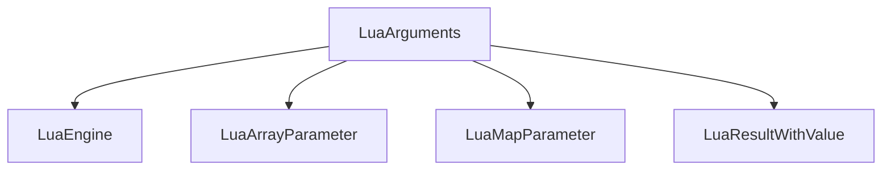

# LuaArguments Class

The `LuaArguments` class provides a fluent interface for validating and reading arguments passed to C++ functions that are called from Lua. It's designed to work with Lua's function call mechanism, allowing developers to:

1. Validate argument count and types before processing
2. Read arguments in a type-safe manner
3. Perform runtime checks for argument validity

## Key Features

### Fluent Validation Interface
- Chainable methods for argument validation (`Count_Is`, `Next_Argument_Is`)
- Type-specific validation (`Next_Argument_Is`, `Next_Argument_Is_Not_Nil`)
- Comprehensive error reporting with detailed messages

### Argument Reading Capabilities
- Type-safe value reading (`Read_Next`, `Read_First`)
- Support for complex data structures like arrays and maps
- Runtime type checking and conversion

## Usage Examples

### Validating Arguments
```cpp
LuaArguments args(engine, "MyFunction(string, int, bool)");
args.Count_Is(3)
   .Next_Argument_Is<std::string>()
   .Next_Argument_Is<int>()
   .Next_Argument_Is<bool>()
   .Assert(); // Throws error if validation fails
```

### Reading Arguments
```cpp
LuaArguments args(engine, "MyFunction()");

// optional args
if (args.First_Read_Is<std::string>()) {
  auto lua_result = args.Read_First<std::string>();
}

// args you have used Assert() to check
auto str_value = args.Read_First<std::string>().Unpack();
```

## Architecture

### Class Relationships



## Core Methods

### Validation Methods
- `Count_Is()` - Validate argument count
- `Next_Argument_Is<T>()` - Validate next argument type
- `First_Argument_Is<T>()` - Validate first argument type
- `Next_Argument_Is_Not_Nil()` - Validate argument is not nil
- `Assert()` - Finalize validation and throw error if invalid

### Reading Methods
- `Read_Next()` - Read next argument value
- `Read_First()` - Read first argument value
- `Read_Next_Array()` - Read array from table
- `Read_Next_Map()` - Read map from table

## Template Concepts

The class supports template-based type validation:
```cpp
template<class T>
LuaArguments& Next_Argument_Is()
{
    // Validate argument type T
    return *this;
}
```

## Implementation Details

### Argument Validation
- Runtime checks against expected argument count
- Type-specific validations using `Is_Type<T>()`
- Error handling with detailed messages

### Value Reading
- Template methods for type-safe value extraction
- Stack-based reading with proper index management
- Support for complex types like arrays and maps

## Important Notes

1. **Fluent Interface**: Methods return references to allow chaining
2. **Runtime Checks**: Validation occurs at runtime when `.Assert()` is called
3. **Error Handling**: Invalid arguments throw detailed error messages
4. **Type Safety**: Template methods provide compile-time type checking
