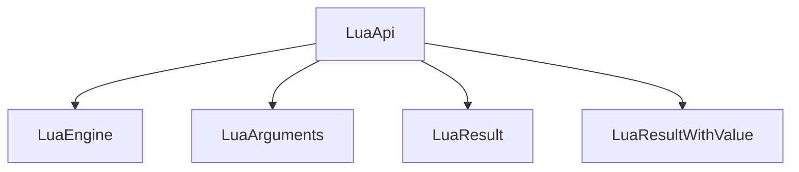

# LuaApi Class

The `LuaApi` class serves as a base wrapper for registering C++ APIs into the Lua environment. It provides a foundation for creating Lua APIs that can be exposed to Lua scripts, including constants, functions, and native modules.

## Key Features

### API Registration
- Fluent interface for registering APIs with dependencies
- Support for both native modules and script files
- Automatic metadata registration
- Runtime dependency resolution

### Configuration Options
- Customizable API names
- Native module support toggle
- Script file inclusion
- Flexible inheritance model

### Integration Points
- Integration with LuaEngine for execution
- Compatibility with LuaArguments for argument validation
- Support for logging and error reporting

## Architecture



## Core Methods

### Registration Methods
- `Register()` - Main registration entry point
- `Register_Dependencies()` - Register API dependencies
- `Register_Consts()` - Register constant values
- `Register_Functions()` - Register functions
- `Register_Native_Module()` - Register native modules
- `Register_Scripts()` - Register Lua script files

### Utility Methods
- `With_Api_Namespace()` - Execute actions in API namespace
- `Register_Api_Metadata()` - Register metadata constants
- `Get_Cpp_Source()` - Get C++ source file information
- `Get_Parent_Lua_Module_Path()` - Get parent Lua module path

## Usage Examples

### Basic API Registration
```cpp
class MyLuaApi : public LuaApi
{
public:
    MyLuaApi() : LuaApi("MyAPI", true) {}

    void Register_Consts(LuaEngine& engine) const override
    {
        engine.With_Api_Namespace(Name, [&](auto& n) {
            n.addConstant("version", "1.0");
        });
    }

    void Register_Functions(LuaEngine& engine) const override
    {
        With_Api_Namespace(engine, [&](auto& n) {
            n.addFunction("print", [](auto L) {
                /**
                 * NOTE: This is a static context, `this` pointer is not available
                 * and no values can be passed into the lambda by reference/value. (Breaks Lua CFunction pointer contract)
                 * 
                 * Use Static classes/global variables in this context as needed.
                 */
                auto engine = SharedLuaEngine(L); // "re-hydrate" engine from Lua state pointer
                auto arguments = LuaArguments(engine, "MyAPI.print(<string: level>)");

                arguments.Count_Is(1)
                    .First_Argument_Is<std::string>()
                    .Assert();

                std::cout << arguments.Read_First<std::string>().Unpack() << std::endl;
            });
        });
    }
};
```

### Advanced API with Dependencies
```cpp
class AdvancedLuaApi : public LuaApi
{
public:
    AdvancedLuaApi() : LuaApi("AdvancedAPI", true, {"init.lua"}) {}

    void Register_Dependencies(LuaEngine& engine) const override
    {
        // Ensure required APIs are registered first
        engine.Register_Api<SystemLuaApi>();
    }

    void Register_Scripts(LuaEngine& engine) const override
    {
        LuaApi::Register_Scripts(engine);
        // Additional script registration logic
    }
};
```

## Template Concepts

### LuaApiConcept
```cpp
template <typename T, typename U>
concept LuaApiConcept = requires(T t, U& e)
{
    { t.Register(e) } -> std::same_as<void>;
    { t.Name } -> std::same_as<const std::basic_string_view<char> &>;
};
```

This concept enforces type constraints for Lua API implementations, ensuring that APIs conform to the expected interface for registration.

## Implementation Guidelines

1. **Inheritance**: Extend `LuaApi` to create custom API implementations
2. **Name Management**: Provide meaningful names for API identification
3. **Dependency Handling**: Implement `Register_Dependencies()` for required APIs
4. **Metadata Registration**: Use `Register_Api_Metadata()` for standard metadata
5. **Function Registration**: Override `Register_Functions()` for function exposure
6. **Native Modules**: Implement `Register_Native_Module()` for C++ module registration

## Important Notes

1. **Fluent Interface**: All methods support chaining for fluent API design
2. **Runtime Validation**: Registration occurs at runtime through `Register()`
3. **Error Handling**: Invalid registrations will generate detailed error messages
4. **Type Safety**: Template methods provide compile-time type checking
5. **Extensibility**: APIs can be extended with custom registration logic

## Next Steps

To explore specific implementations:
- Review [SystemLuaApi](../lua-cpp-api/system_luaapi.h) for a concrete example
- Examine [RulesLuaApi](../lua-cpp-api/rules_luaapi.h) for another implementation
- Check [LoggingLuaApi](../lua-cpp-api/logging_luaapi.h) for logging integration
