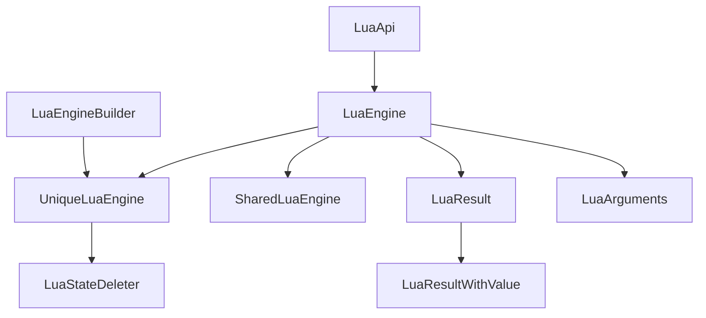

# Lua/C++ API Documentation

This documentation provides comprehensive information about the Lua/C++ integration system used in this project. The API allows C++ code to interact with Lua scripts through a fluent interface.

## Overview

The system uses [LuaBridge](https://github.com/vinniefalco/LuaBridge) to provide a fluent interface for declaring classes, functions and variables in Lua. It provides both synchronous and asynchronous execution capabilities, along with robust error handling.

## Architecture

This API follows a layered architecture:

## Core Components

### LuaEngine (Base Class)
The abstract base class providing core functionality for interacting with Lua.

### UniqueLuaEngine 
Provides context-specific engine instances that ensure clean state when starting a new context.

### SharedLuaEngine
For wrapping around states not owned by the current context, such as in Lua CFunctions.

### LuaEngineBuilder
Fluent builder that makes registering APIs easier.

## Getting Started

To use this API:
1. Include the necessary headers
2. Create or obtain a Lua engine instance
3. Register your APIs using LuaApi classes
4. Execute Lua scripts or functions
