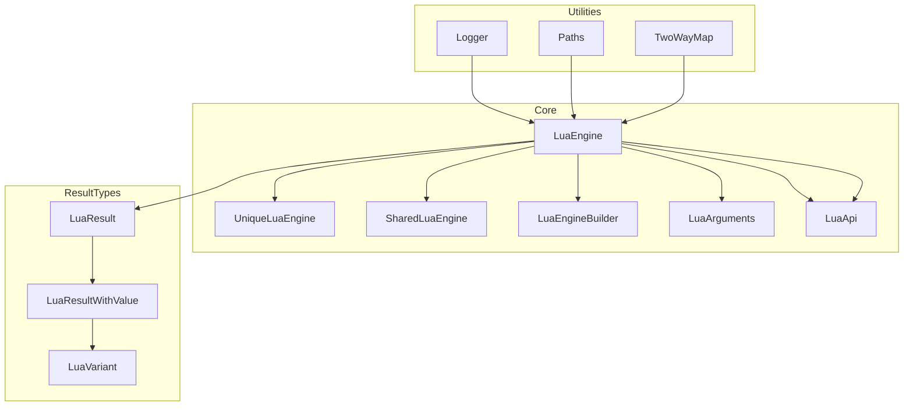

# Lua/C++ API Complete Reference

This comprehensive reference documents all key components of the Lua/C++ integration system, providing developers with complete information about classes, usage patterns, and architecture.

## System Overview

The Lua/C++ API system enables seamless interaction between C++ code and Lua scripts through a fluent interface built on LuaBridge. It supports both synchronous and asynchronous execution with robust error handling capabilities.

## Core Classes

### 1. LuaEngine (Base Abstract Class)
- Provides core functionality for Lua interactions
- Defines the base interface for all engine implementations
- Handles state management, execution, and value operations

### 2. UniqueLuaEngine 
- Context-specific engine instances ensuring clean state
- Uses smart pointer unique logic for automatic cleanup
- Manages persistent global state through `Global()` method

### 3. SharedLuaEngine
- For wrapping around states not owned by the current context
- Aligns with shared pointer logic for non-unique contexts
- Supports Lua CFunctions and other shared environments

### 4. LuaEngineBuilder
- Fluent builder pattern for engine configuration
- Simplifies API registration through method chaining
- Provides compile-time type safety constraints

### 5. LuaArguments
- Fluent interface for validating and reading arguments
- Supports runtime argument validation and type checking
- Enables safe argument processing in C++ functions called from Lua

### 6. LuaApi
- Base wrapper for registering C++ APIs into the Lua environment
- Provides foundation for creating Lua APIs that can be exposed to Lua scripts
- Supports constants, functions, and native modules registration

### 7. LuaResult Classes
- `LuaResult` - Base result type with error information
- `LuaResultWithValue<T>` - Specialized results that can return typed values
- Support for comprehensive error reporting and value extraction

## Architecture Diagram



## Key Usage Patterns

### Engine Creation
```cpp
// Context-specific engine
UniqueLuaEngine engine = UniqueLuaEngine();

// Global persistent engine  
const auto& global_engine = UniqueLuaEngine::Global();
```

### API Registration
```cpp
auto builder = LuaEngineBuilder<UniqueLuaEngine>();
builder.With_Api<SystemLuaApi>()
       .With_Api<GraphicsLuaApi>()
       .Build();
```

### Script Execution
```cpp
auto result = engine.Exec("print('Hello')");

if (result.Is_Ok()) {
    // Success handling
} else {
    // Error handling
}
```

## Error Handling

All operations return `LuaResult` types which provide:
- Success/failure status checks (`Is_Ok()`)
- Detailed error messages with context (`Error_Message()`)
- Type-safe value extraction (`Try_Read<T>()`)

## Value Operations

### Reading Values
- `Try_Read<T>()` - Read and type-check a stack value
- `Try_Read_Table_Field<T>()` - Read from table fields
- `Eval<T>()` - Evaluate expressions returning values

### Writing Values
- `Push_Value()` - Push C++ values to Lua stack
- `Set_Table_Field()` - Set table field values
- `To_String()` - Convert values to string representations

## Templates and Concepts

### LuaApiConcept
```cpp
template <typename T, typename U>
concept LuaApiConcept = requires(T t, U& e)
{
    { t.Register(e) } -> std::same_as<void>;
    { t.Name } -> std::same_as<const std::basic_string_view<char> &>;
};
```

## Implementation Guidelines

1. **Context Isolation**: Use UniqueLuaEngine for new contexts
2. **Global State**: Access Global() engine for persistent state
3. **Argument Validation**: Use LuaArguments for safe argument processing
4. **Error Handling**: Always check `Is_Ok()` before processing results
5. **Type Safety**: Use template methods for type-safe value operations
6. **Resource Management**: Let smart pointers handle cleanup automatically

## Next Steps

For more detailed information about specific classes:
- Refer to [LuaEngine documentation](engine.md)
- Review [UniqueLuaEngine details](unique_engine.md)
- Examine [Builder pattern](builder.md)
- Explore [Arguments handling](arguments.md)
- Explore [API registration](api.md)
