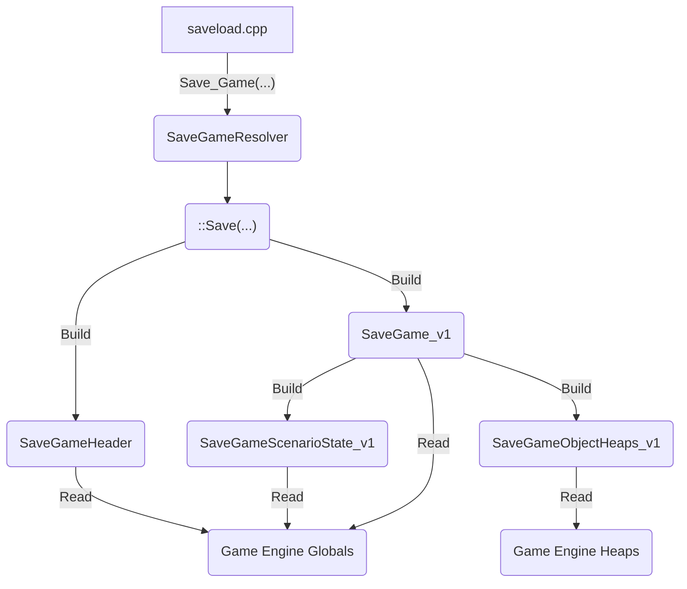
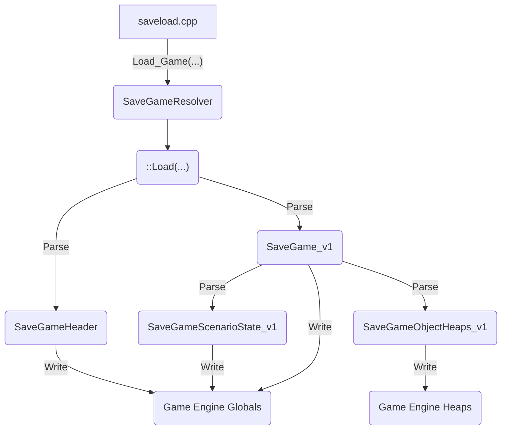

The new format for save games in New Construction Options is JSON. This will take the entire object graph that is saved in the old binary format and dump it to JSON objects. References to game types (enums) will be saved as strings rather than the enum values, ensuring no magic numbers are written to save games.

**An overview of the JSON save game features:**

- **Portable Format**
    - Using JSON as the serialization format ensures that save games are the same format on all platforms. JSON uses UTF-8 and a set of fixed typed that can be translated to the current C++ platform types/binary format
- **Backwards Compatibility**
    - Use the same logic as for rules INI files for converting enum values to/from strings
        - For example: the value of an enum can change in the game engine, the save game logic will just resolve the new value by name
        - In short, no magic numbers that are only meaningful to one version of the game engine will be written to save games
        - Especially useful for modding the game engine
    - Make the save game format versioned, starting with `v1`
        - If a new version of the save game format is required, this can add "extensions" to the `v1` format
        - Default values and behavior can be added in the future to ensure `v1` saves can continue to be loaded, even though they don't have the `v2` or `v3` data (for example)
- **Easy Reading & Editing**
    - Save game files will be in `JSONL` format: header + `\n` + body
    - The game engine reads just the header to quickly list save game files in the load dialog (mirroring old binary save format behavior)
    - Files can be edited in any text editor
    - JSON libraries widely available, so scripts/custom apps can be made which work with the format
- **Foundation for New Features**
    - The JSON format created here could be the basis for a new scenario format
        - Scenario BIN files have similar drawbacks as binary save game files
    - The ability to convert game objects to/from JSON easily could be useful for YAML based game rules (instead of INI files)

The new JSON saves still preserve all the scenario state in one file, so custom scenarios can still be shared via save games.
## Architecture

- JSON serialisation support is provided by the 'JSON for Modern C++' library ([https://github.com/nlohmann/json](https://github.com/nlohmann/json))
- A utility class `CncJsonUtils` and helper macros are defined in `common/json.h`
- Validation functions in `CncJsonUtils` throw a custom exception type `CncJsonException` on assert failures
- `friend` functions are added to the class definition of each class that is stored in JSON save games (these read/write fields to/from JSON using the library API)
- The `tiberiandawn/saveload.cpp` file has been updated to have new Save and Load routines that use the `SaveGameResolver` class to read/write global objects to/from JSON to manage game scenario state 
- `SaveGameResolver` calls a v1 implementation of the Save Game format and logic in `tiberiandawn/savegame_v1.cpp`
- `Get_Savefile_Info(..)` in `tiberiandawn/saveload.cpp` is called when the `loaddlg.cpp` code searches for save game files to list in the 'Load Game' menu. `SaveGameResolver` reads the `SaveGameHeader` from the file given, which validates header structure the extracts the display info for the load dialog.

### Save Game Flow


### Load Game Flow

## JSON Functions

- Each class that requires serialisation has `JSON_FUNCTIONS(<TYPE>)` declared to invoke the `common/json.h` macro that expands to `friend` function prototypes
- The `TO_JSON` and `FROM_JSON` macros are used to create the function definitions

```c++
TO_JSON(AircraftClass)  
{    
	FIELD_TO_JSON(SecondaryFacing);
    // ...
}

FROM_JSON(AircraftClass)  
{
	FIELD_FROM_JSON(SecondaryFacing);
    // ...
}
```

- If a class has one or more base classes, the friend function for the base class in called here to ensure all the inherited fields are included
- Macros and helper methods from `common/json.h` are used to convert bitfields and C Strings to/from JSON - converting them to easier to store representations
	- Bitfields that are wider than 1 bit use the `std::bitset` class to provide a portable way of storing bitfields as strings
- `TdTypeConverter` also provides macros in `tiberiandawn/typeconvertermacros.h`
	- These provide easy ways to read/write enum value fields, ensuring JSON representation uses INI string names rather than enum number values
	- Wrappers around methods in `TdTypeConverter` to  read/write pointer references for objects and type references (Infantry types etc.)
## Object Pointers

- The game engine uses heaps of type `TFixedIHeapClass` to store an arbitrary number of objects for each type in the game (Infantry, Terrain, Buildings etc.)
- The contents of the heaps will change over the course of a scenario (unit built, team reinforced, smudge created by explosion etc.)
- When a class uses a pointer to an object (say for example a map cell which lists the objects currently occupying it), this will point to an object on the heap
- The `TARGET` alias type is used to record the kind and ID of a pointer, which is used in game logic and by the original binary save logic (this is packed into an integer number)
- This target allows resolving back to a specific heap (kind) and the ID of the object in that heap
	- The `As_Target` method in classes that support being stored as a target generates the number value for a `TARGET`
	- See the `TARGET_TO_PTR_WITH_TYPE` macro for how we store the `TARGET` value read from JSON in the address storage of a pointer
- The new JSON save format reuses this logic to store references to heap pointers as numbers, which are later hydrated back to the actual heap pointer by the `Decode_All_Pointers` function in `tiberiandawn/saveload.cpp`
## Type References

- Most objects in the heap and some outside the heap contain a reference to the type info (UnitTypeClass etc.) that defines static behaviour for types of objects (Speed, Cost etc.)
- The original binary save game logic preformed a similar TARGET operation to record the type of the object and the ID of the instance type
	- See the `TECHNO_TYPE_PTR_REF_TO_JSON` and `TECHNO_TYPE_TARGET_PTR_FROM_REF_JSON_WITH_TYPE` macros
- To ensure we keep save games decoupled from game engine changes (specifically enum value changes) this has changed to be a JSON object modelled by `TechnoTypeClassJsonReference` (which stores the Type Reference Kind and Instance by the INI name)
- On deserialise, the save game logic places the integer enum value that maps to the INI Name in the pointer address storage (matching the old binary save logic for storing type references)
- The `Decode_All_Pointers` function in `tiberiandawn/saveload.cpp` then ensures this is resolved back to the actual static type instance pointer

## JSON File Structure

A JSON save game file is stored in JSONL (JSON Lines) format.  This is essentially one JSON value per line, separated by a `\n` on all platforms.

To be explicit, here is the structure:
```plaintext
<< HEADER >>\n<< BODY >>
```

### Header

The HEADER line is the header for the save (*the below JSON would not have any spaces or newlines, but they are included to make it easy to read*)

```json
{
  "Description": "My Save Game",
  "PlayerHouseType": "BAD",
  "PlayerType": "NOD",
  "ScenarioID": 1,
  "Version": "v1"
}
```

- This data is read by the load save game dialog to format each save game file in the GUI list
- Note the `HousesType` enum string values
### Body

The BODY line is the bulk of the save game data - containing all the static data, global variables and object heaps. These combined represent the entire game state, so it's very large, between 250 Kb and 3 Mb of data.

*Comments are included below, BUT these do NOT appear in the real save game JSON (also, like the header - the below JSON would not have any spaces or newlines, but they are included to make it easy to read)*

```json
// SaveGame_v1 class 
{  
  "AiBase": {  
    "House": "GOOD",  
    "Nodes": {  
      // this is a DynamicVectorClass instance (you will see it throughout this file)  
      "ActiveCount": 0,  
      "GrowthStep": 10,  
      "_items": {  
        "0": {  
          "Type": "PYLE",  
          "Coord": 0  
        }  
      },  
      "_vector_size": 0  
    }  
  },  
  "GameCellTriggers": {  
    "ActiveCount": 0,  
    "GrowthStep": 10,  
    "_items": {  
      "3119": 167772165,  
      "3120": 167772165,  
      // ...  
    },  
    "_vector_size": 16384  
  },  
  // one object per house  
  "GameHouseTriggers": [  
    { // GoodGuy (GDI)  
      "ActiveCount": 4,  
      "GrowthStep": 10,  
      "_items": {  
        "0": 167772160,  
        "1": 167772164,  
        // ...  
      },  
      "_vector_size": 10  
    },  
    // ...  
  ],  
  // sounds more important than it is, actual data is just object pointers  
  "GameLogic": [  
    83886080,  
    83886081,  
    // ...  
  ],  
  "GameMap": {  
    // each cell on the map that has non-default data is here  
    "Array": {  
      "1557": {  
        "CTFFlag": 0,  
        "Flag": "00000000",  
        "InfType": "NONE",  
        "IsCursorHere": false,  
        "IsFlagged": false,  
        "IsMapped": false,  
        "IsMappedByPlayerMask": 0,  
        "IsPlot": false,  
        "IsRadarCursor": false,  
        "IsTrigger": false,  
        "IsVisible": false,  
        "IsVisibleByPlayerMask": 0,  
        "IsWaypoint": false,  
        "Land": "ROCK",  
        "OccupierPtr": 0,  
        "Overlapper": [  
          0,  
          0,  
          // ...  
        ],  
        "Overlay": "NONE",  
        "OverlayData": 0,  
        "OverrideLand": "COUNT",  
        "Owner": "NONE",  
        "Smudge": "NONE",  
        "SmudgeData": 0,  
        "TIcon": 0,  
        "TType": "SLOPE3"  
      },  
      // ...  
    },  
    "BandX": 413,  
    "BandY": 121,  
    "BaseX": 8,  
    "BaseY": 28,  
    "ButtonHeight": 18,  
    "ButtonOneWidth": 0,  
    "ButtonThreeWidth": 0,  
    "ButtonTwoWidth": 0,  
    "Color": 14,  
    // player sidebar columns  
    "Column": [  
      {  
        "BuildableCount": 0,  
        "Buildables": [  
          {  
            "BuildableID": "NUKE",  
            "BuildableType": "BUILDINGTYPE",  
            "BuildableViaCapture": false,  
            "Factory": -1  
          },  
          // ...  
        ],  
        "ButtonSpacingOffset": 2,  
        "Flasher": -1,  
        "ID": 0,  
        "IsBuilding": false,  
        "IsScrolling": false,  
        "IsScrollingDown": false,  
        "IsToRedraw": true,  
        "LeftEdgeOffset": 3,  
        "ObjectHeight": 48,  
        "ObjectWidth": 64,  
        "Rate": 0,  
        "Scroller": 0,  
        "Slid": 0,  
        "Stage": 0,  
        "StageTimer": 0,  
        "StripWidth": 70,  
        "TopIndex": 0,  
        "X": 497,  
        "Y": 182  
      },  
      // there are two 'strip' objects, one per column  
    ],  
    "Cost": 0,  
    "Credits": {  
      "Countdown": 0,  
      "Current": 0,  
      "IsAudible": false,  
      "IsToRedraw": false,  
      "IsUp": false  
    },  
    "CurrentMouseShape": "NORMAL",  
    "CursorShapeSave": [  
      9456,  
      15346,
      // ... 
    ],  
    "DesiredDrainHeight": 0,  
    "DesiredPowerHeight": 0,  
    "DesiredTacticalCoord": 251666261,  
    "DoesRadarExist": false,  
    "DrainBounce": 0,  
    "DrainDir": 0,  
    "DrainHeight": 0,  
    "DrawX": 423,  
    "DrawY": 136,  
    "Eva_Width": 160,  
    "Frame": 0,  
    "HelpWidth": 0,  
    "HelpX": 0,  
    "HelpY": 0,  
    "Inertia": 0,  
    "IsActive": false,  
    "IsAutoScroll": true,  
    "IsDemolishActive": false,  
    "IsForwardScan": true,  
    "IsPlayerNames": false,  
    "IsRadarActivating": false,  
    "IsRadarActive": false,  
    "IsRadarDeactivating": false,  
    "IsRepairActive": false,  
    "IsRepairMode": false,  
    "IsRight": false,  
    "IsRubberBand": false,  
    "IsSellMode": false,  
    "IsShadowPresent": true,  
    "IsSidebarActive": false,  
    "IsSmall": false,  
    "IsTargettingMode": "00",  
    "IsTentative": false,  
    "IsToRedraw": false,  
    "IsToUpdate": false,  
    "IsUpgradeActive": false,  
    "IsZoomed": false,  
    "MapBinaryVersion": 0,  
    "MapCellHeight": 24,  
    "MapCellWidth": 37,  
    "MapCellX": 21,  
    "MapCellY": 14,  
    "MaxVisible": 4,  
    "NewX": 413,  
    "NewY": 121,  
    "NormalMouseShape": "CAN_MOVE",  
    "PendingHouse": "NONE",  
    "PendingObjectPtr": 0,  
    "PixelPtr": 0,  
    "PixelStack": [  
      0,  
      0,  
      // ...  
    ],  
    "PowHeight": 224,  
    "PowLineSpace": 10,  
    "PowLineWidth": 12,  
    "PowWidth": 16,  
    "PowX": 480,  
    "PowY": 176,  
    "PowerBounce": 0,  
    "PowerDir": 0,  
    "PowerHeight": 0,  
    "ProximityCheck": false,  
    "RadHeight": 140,  
    "RadIHeight": 128,  
    "RadIWidth": 128,  
    "RadOffX": 16,  
    "RadOffY": 7,  
    "RadPHeight": 256,  
    "RadPWidth": 256,  
    "RadWidth": 160,  
    "RadX": 480,  
    "RadY": 14,  
    "RadarAnimFrame": "000000",  
    "RadarCell": 1813,  
    "RadarCellHeight": 24,  
    "RadarCellWidth": 37,  
    "RadarCursorRedraw": false,  
    "RadarHeight": 72,  
    "RadarWidth": 111,  
    "RadarX": 21,  
    "RadarY": 14,  
    "RecordedDrain": -1,  
    "RecordedPower": -1,  
    "SideBarWidth": 160,  
    "SideHeight": 245,  
    "SideWidth": 160,  
    "SideX": 480,  
    "SideY": 155,  
    "Size": 16384,  
    "SpecialRadarFrame": "000",  
    "Tab_Height": 16,  
    "TacLeptonHeight": 4096,  
    "TacLeptonWidth": 6827,  
    "TacPixelX": 0,  
    "TacPixelY": 16,  
    "TacticalCoord": 251666261,  
    "Text": 0,  
    "Theater": "DESERT",  
    "TiberiumGrowth": [  
      0,  
      0,  
      // ...  
    ],  
    "TiberiumGrowthCount": 0,  
    "TiberiumScan": 14518,  
    "TiberiumSpread": [  
      0,  
      0,  
      // ...  
    ],  
    "TiberiumSpreadCount": 0,  
    "TopHeight": 26,  
    "TotalValue": 0,  
    "Width": 131,  
    "X": 413,  
    "XSize": 128,  
    "Y": 136,  
    "YSize": 128,  
    "ZoneCell": 2608,  
    "ZoneOffset": 0,  
    "ZoomFactor": 3  
  },  
  "GameScore": {  
    "CBKilled": 0,  
    "CHarvested": 0,  
    "CKilled": 0,  
    "ElapsedTime": 488,  
    "GBKilled": 0,  
    "GHarvested": 0,  
    "GKilled": 0,  
    "NBKilled": 0,  
    "NHarvested": 0,  
    "NKilled": 0,  
    "Score": 0  
  },  
  // object pointers grouped by location on a map cell (See LayerType)  
  "Layers": [  
    // ground  
    [  
      50331682,  
      50331683,  
      // ...  
    ],  
    // air  
    [],  
    // top  
    []  
  ],
  // SaveGameObjectHeaps_v1 class
  "Objects": {  
    "AircraftHeap": {  
      "0": {  
        "Altitude": 0,  
        "Ammo": 15,  
        "ArchiveTarget": 0,  
        "Arm": 0,  
        "AttacksRemaining": 3,  
        "BaseAttackTimer": {  
          "DelayTime": 0,  
          "Started": 0  
        },  
        "CargoHold": 0,  
        // instance of TechnoTypeClassJsonReference  
        "Class": {  
          "Instance": "HELI",  
          "Kind": "AIRCRAFT"  
        },  
        "Cloak": "UNCLOAKED",  
        "CloakingDevice": {  
          "Rate": 0,  
          "Stage": 1,  
          "StageTimer": 0  
        },  
        "Control": {  
          "Rate": 0,  
          "Stage": 0,  
          "StageTimer": 0  
        },  
        "Coord": 767560192,  
        "FlashCount": false,  
        "FlashCountPerPlayer": [  
          0,  
          0,  
          // ...  
        ],  
        "Group": 255,  
        "HeadToCoord": 0,  
        "House": "BAD",  
        "IsALemon": false,  
        "IsALoaner": false,  
        "IsActive": true,  
        "IsAnimAttached": false,  
        "IsBlushing": false,  
        "IsCloakable": false,  
        "IsDeploying": false,  
        "IsDiscoveredByComputer": false,  
        "IsDiscoveredByPlayer": false,  
        "IsDiscoveredByPlayerMask": 0,  
        "IsDown": true,  
        "IsDriving": false,  
        "IsFiring": false,  
        "IsHoming": false,  
        "IsHovering": false,  
        "IsInLimbo": false,  
        "IsInRecoilState": false,  
        "IsInitiated": false,  
        "IsLanding": false,  
        "IsLeader": false,  
        "IsLocked": true,  
        "IsNewNavCom": false,  
        "IsOwnedByPlayer": false,  
        "IsPlanningToLook": false,  
        "IsRecentlyCreated": true,  
        "IsRotating": false,  
        "IsSecondShot": false,  
        "IsSelected": false,  
        "IsSelectedMask": 0,  
        "IsTakingOff": false,  
        "IsTethered": true,  
        "IsTickedOff": false,  
        "IsToDamage": false,  
        "IsToDisplay": false,  
        "IsToRedraw": false,  
        "IsUnloading": false,  
        "Jitter": 0,  
        "Kills": 0,  
        "LastMessage": "REDRAW",  
        "LineCount": 0,  
        "LineFrame": 0,  
        "LineMaxFrames": 0,  
        "Lines": [  
          [  
            0,  
            0,  
            // ...  
          ],  
	      // ...
        ],  
        "Member": 0,  
        "Mission": "GUARD",  
        "MissionQueue": "NONE",  
        "NavCom": 0,  
        "Next": 67108871,  
        "Path": "NONE,N,N,N,N,N,N,N,N",  
        "PathDelay": {  
          "DelayTime": 0,  
          "Started": 0  
        },  
        "PrimaryFacing": {  
          "CurrentFacing": "NE",  
          "DesiredFacing": "NE"  
        },  
        "PurchasePrice": 0,  
        "Quantity": 0,  
        "Radio": 67108871,  
        "Rate": 1,  
        "ReinforcementStart": -1,  
        "SecondaryFacing": {  
          "CurrentFacing": "NE",  
          "DesiredFacing": "NE"  
        },  
        "SightTimer": {  
          "DelayTime": 0,  
          "Started": 0  
        },  
        "Speed": 0,  
        "SpeedAccum": 0,  
        "SpeedAdd": "IMMOBILE",  
        "Stage": 89,  
        "StageTimer": 1,  
        "Stages": 0,  
        "State": "CLOSED",  
        "Status": 0,  
        "Strength": 125,  
        "SuspendedMission": "NONE",  
        "SuspendedNavCom": 0,  
        "SuspendedTarCom": 0,  
        "TARGET": 100663296,  
        "TarCom": 0,  
        "Team": 0,  
        "Timer": {  
          "DelayTime": 17,  
          "Started": 88  
        },  
        "Trigger": 0,  
        "TryTryAgain": 10  
      },  
      // ...  
    },  
    "AnimsHeap": {  
      "0": {  
        "Accum": 0,  
        "Class": {  
          "Instance": "VEH_HIT2",  
          "Kind": "ANIMATION"  
        },  
        "Coord": 545534359,  
        "Delay": 0,  
        "IsActive": true,  
        "IsAlternate": false,  
        "IsAnimAttached": false,  
        "IsBrandNew": false,  
        "IsDown": true,  
        "IsInLimbo": false,  
        "IsInvisible": false,  
        "IsRecentlyCreated": true,  
        "IsSelected": false,  
        "IsSelectedMask": 0,  
        "IsToDamage": false,  
        "IsToDelete": false,  
        "IsToDisplay": false,  
        "KillTime": 0,  
        "Loops": 1,  
        "Next": 0,  
        "Object": 0,  
        "OwnerHouse": "NONE",  
        "Rate": 2,  
        "SortTarget": 33554467,  
        "Stage": 2,  
        "StageTimer": 1,  
        "Strength": 255,  
        "TARGET": 150994944,  
        "Trigger": 0,  
        "VirtualAnim": 0,  
        "VisibleFlags": 4294967295  
      },  
      // ...  
    },  
    "BuildingsHeap": {  
      "0": {  
        "ActLike": "NEUTRAL",  
        "Ammo": -1,  
        "ArchiveTarget": 0,  
        "Arm": 0,  
        "BState": "IDLE",  
        "CargoHold": 0,  
        "Class": {  
          "Instance": "V26",  
          "Kind": "BUILDING"  
        },  
        "Cloak": "UNCLOAKED",  
        "CloakingDevice": {  
          "Rate": 0,  
          "Stage": 1,  
          "StageTimer": 0  
        },  
        "Control": {  
          "Rate": 0,  
          "Stage": 0,  
          "StageTimer": 0  
        },  
        "Coord": 352328192,  
        "CountDown": {  
          "DelayTime": 0,  
          "Started": 0  
        },  
        "Factory": 0,  
        "FlashCount": false,  
        "FlashCountPerPlayer": [  
          0,  
          0,  
          // ...  
        ],  
        "House": "NEUTRAL",  
        "IsALemon": false,  
        "IsALoaner": false,  
        "IsActive": true,  
        "IsAnimAttached": false,  
        "IsBlushing": false,  
        "IsCaptured": false,  
        "IsCharged": false,  
        "IsCharging": false,  
        "IsCloakable": false,  
        "IsDiscoveredByComputer": false,  
        "IsDiscoveredByPlayer": false,  
        "IsDiscoveredByPlayerMask": 0,  
        "IsDown": true,  
        "IsGoingToBlow": false,  
        "IsInLimbo": false,  
        "IsInRecoilState": false,  
        "IsLeader": false,  
        "IsLocked": true,  
        "IsOwnedByPlayer": false,  
        "IsReadyToCommence": true,  
        "IsRecentlyCreated": true,  
        "IsRepairing": false,  
        "IsSecondShot": true,  
        "IsSelected": false,  
        "IsSelectedMask": 0,  
        "IsSurvivorless": false,  
        "IsTethered": false,  
        "IsTickedOff": false,  
        "IsToDamage": false,  
        "IsToDisplay": false,  
        "IsToRedraw": false,  
        "IsWrenchVisible": false,  
        "Kills": 0,  
        "LastMessage": "STATIC",  
        "LastStrength": 400,  
        "LineCount": 0,  
        "LineFrame": 0,  
        "LineMaxFrames": 0,  
        "Lines": [  
          [  
            0,  
            0,  
            // ...  
          ],  
          // ...  
        ],  
        "Mission": "GUARD",  
        "MissionQueue": "NONE",  
        "Next": 0,  
        "PlacementDelay": {  
          "DelayTime": 0,  
          "Started": 0  
        },  
        "PrimaryFacing": {  
          "CurrentFacing": "MIN",  
          "DesiredFacing": "MIN"  
        },  
        "PurchasePrice": 0,  
        "Quantity": 0,  
        "QueueBState": "NONE",  
        "Radio": 0,  
        "RallyPoint": 0,  
        "Rate": 0,  
        "Stage": 0,  
        "StageTimer": 0,  
        "Stages": 0,  
        "State": "CLOSED",  
        "Status": 1,  
        "Strength": 400,  
        "SuspendedMission": "NONE",  
        "SuspendedTarCom": 0,  
        "TARGET": 67108864,  
        "TarCom": 0,  
        "Timer": {  
          "DelayTime": 75,  
          "Started": 75  
        },  
        "Trigger": 0,  
        "WhoLastHurtMe": "NEUTRAL",  
        "WhomToRepay": 0  
      },  
      // ...  
    },  
    "BulletsHeap": {  
      "0": {  
        "Altitude": 136,  
        "Arming": 0,  
        "Class": {  
          "Instance": "GRENADE",  
          "Kind": "BULLET"  
        },  
        "Coord": 904673945,  
        "HeadTo": 880032573,  
        "IsActive": true,  
        "IsAnimAttached": false,  
        "IsDown": true,  
        "IsInLimbo": false,  
        "IsInaccurate": false,  
        "IsLocked": true,  
        "IsRecentlyCreated": true,  
        "IsSelected": false,  
        "IsSelectedMask": 0,  
        "IsToAnimate": false,  
        "IsToDamage": false,  
        "IsToDisplay": false,  
        "Next": 0,  
        "Payback": 50331692,  
        "PrimaryFacing": {  
          "CurrentFacing": "21",  
          "DesiredFacing": "21"  
        },  
        "Proximity": 458,  
        "Riser": 12,  
        "SpeedAccum": 2,  
        "SpeedAdd": "32",  
        "Strength": 50,  
        "TARGET": 134217728,  
        "TarCom": 50331680,  
        "Timer": 53,  
        "Trigger": 0  
      },  
      // ...  
    },  
    "FactoriesHeap": {  
      "0": {  
        "Balance": true,  
        "House": "GOOD",  
        "IsActive": true,  
        "IsBlocked": false,  
        "IsDifferent": true,  
        "IsSuspended": false,  
        "Object": 50331648,  
        "OriginalBalance": false,  
        "Rate": 1,  
        "SpecialItem": 0,  
        "Stage": 52,  
        "StageTimer": 1  
      },  
      // ...  
    },  
    "HousesHeap": {  
      "0": {  
        "AITimer": {  
          "DelayTime": 0,  
          "Started": 0  
        },  
        "AQuantity": [  
          0,  
          0,  
          0,  
          0,  
          0  
        ],  
        "AScan": 0,  
        "ActLike": "GOOD",  
        "ActiveAScan": 0,  
        "ActiveBScan": 0,  
        "ActiveIScan": 2049,  
        "ActiveUScan": 256,  
        "AirStrike": {  
          "Control": {  
            "DelayTime": 0,  
            "Started": 0  
          },  
          "IsOneTime": false,  
          "IsPresent": false,  
          "IsReady": false,  
          "IsSuspended": false,  
          "OldStage": -1,  
          "RechargeTime": 7200,  
          "SuspendTime": 0,  
          "VoxCharging": "NONE",  
          "VoxImpatient": "NOT_READY",  
          "VoxRecharge": "AIRSTRIKE_READY",  
          "VoxSuspend": "NOT_READY"  
        },  
        "AircraftFactories": 0,  
        "AircraftFactory": -1,  
        "AircraftTotals": {  
          "InNetworkFormat": 0,  
          "UnitTotals": [  
            0,  
            0,
            // ...
          ]  
        },  
        "AirspeedBias": "1",  
        "AlertTime": {  
          "DelayTime": 0,  
          "Started": 0  
        },  
        "Allies": 5,  
        "ArmorBias": "1",  
        "Attack": {  
          "DelayTime": 5150,  
          "Started": 0  
        },  
        "BQuantity": [  
          0,  
          0,  
          // ...  
        ],  
        "BScan": 0,  
        "BlitzTime": {  
          "DelayTime": 0,  
          "Started": -1  
        },  
        "Blockage": 0,  
        "BorrowedTime": {  
          "DelayTime": 0,  
          "Started": 0  
        },  
        "BuildAircraft": "NONE",  
        "BuildDelay": "0.289",  
        "BuildInfantry": "NONE",  
        "BuildSpeedBias": "1",  
        "BuildStructure": "NONE",  
        "BuildUnit": "NONE",  
        "BuildingFactories": 0,  
        "BuildingFactory": -1,  
        "BuildingTotals": {  
          "InNetworkFormat": 0,  
          "UnitTotals": [  
            0,  
            0,  
            // ...  
          ]  
        },  
        "BuildingsKilled": [  
          0,  
          0,  
          // ...  
        ],  
        "BuildingsLost": 0,  
        "Capacity": 0,  
        "CapturedBuildings": {  
          "InNetworkFormat": 0,  
          "UnitTotals": [  
            0,  
            0,  
            // ...  
          ]  
        },  
        "Center": 0,  
        "Class": "GOOD",  
        "CostBias": "1",  
        "Credits": 0,  
        "CreditsSpent": 0,  
        "CurAircraft": 0,  
        "CurBuildings": 0,  
        "CurInfantry": 16,  
        "CurUnits": 18,  
        "DamageTime": {  
          "DelayTime": 900,  
          "Started": 0  
        },  
        "DebugUnlockBuildables": false,  
        "DestroyedAircraft": {  
          "InNetworkFormat": 0,  
          "UnitTotals": [  
            0,  
            0,  
            // ...  
          ]  
        },  
        "DestroyedBuildings": {  
          "InNetworkFormat": 0,  
          "UnitTotals": [  
            0,  
            0,  
            // ...  
          ]  
        },  
        "DestroyedInfantry": {  
          "InNetworkFormat": 0,  
          "UnitTotals": [  
            0,  
            0,  
            // ...  
          ]  
        },  
        "DestroyedUnits": {  
          "InNetworkFormat": 0,  
          "UnitTotals": [  
            0,  
            0,  
            // ...  
          ]  
        },  
        "Difficulty": "NORMAL",  
        "Drain": 0,  
        "Edge": "SOUTH",  
        "Enemy": "NONE",  
        "FirepowerBias": "1",  
        "FlagHome": 0,  
        "FlagLocation": 0,  
        "FreeHarvester": {  
          "DelayTime": 0,  
          "Started": 0  
        },  
        "GroundspeedBias": "1",  
        "HarvestedCredits": 0,  
        "IGaveUp": false,  
        "IQ": 5,  
        "IQuantity": [  
          15,  
          0,  
          // ...  
        ],  
        "IScan": 2049,  
        "InfantryFactories": 0,  
        "InfantryFactory": -1,  
        "InfantryTotals": {  
          "InNetworkFormat": 0,  
          "UnitTotals": [  
            0,  
            0,  
            // ...  
          ]  
        },  
        "InitialCredits": 0,  
        "IonCannon": {  
          "Control": {  
            "DelayTime": 0,  
            "Started": 0  
          },  
          "IsOneTime": false,  
          "IsPresent": false,  
          "IsReady": false,  
          "IsSuspended": false,  
          "OldStage": -1,  
          "RechargeTime": 9000,  
          "SuspendTime": 0,  
          "VoxCharging": "ION_CHARGING",  
          "VoxImpatient": "ION_CHARGING",  
          "VoxRecharge": "ION_READY",  
          "VoxSuspend": "NO_POWER"  
        },  
        "IsActive": true,  
        "IsAirstrikePending": false,  
        "IsAlerted": false,  
        "IsBaseBuilding": true,  
        "IsCivEvacuated": false,  
        "IsDefeated": false,  
        "IsDiscovered": false,  
        "IsFreeHarvester": false,  
        "IsHuman": false,  
        "IsMaxedOut": false,  
        "IsParanoid": false,  
        "IsRecalcNeeded": true,  
        "IsStarted": false,  
        "IsTiberiumShort": false,  
        "IsToDie": false,  
        "IsToLose": false,  
        "IsToWin": false,  
        "IsVisionary": false,  
        "JustBuilt": "NONE",  
        "LAEnemy": "NONE",  
        "LATime": 0,  
        "LAType": "NONE",  
        "LAZone": "NONE",  
        "MaxAircraft": 0,  
        "MaxBuilding": 150,  
        "MaxInfantry": 0,  
        "MaxUnit": 282,  
        "Name": "Computer",  
        "NewAScan": 0,  
        "NewActiveAScan": 0,  
        "NewActiveBScan": 0,  
        "NewActiveIScan": 0,  
        "NewActiveUScan": 0,  
        "NewBScan": 0,  
        "NewIScan": 0,  
        "NewUScan": 0,  
        "NukeDest": 0,  
        "NukePieces": "111",  
        "NukeStrike": {  
          "Control": {  
            "DelayTime": 0,  
            "Started": 0  
          },  
          "IsOneTime": false,  
          "IsPresent": false,  
          "IsReady": false,  
          "IsSuspended": false,  
          "OldStage": -1,  
          "RechargeTime": 12600,  
          "SuspendTime": 0,  
          "VoxCharging": "NONE",  
          "VoxImpatient": "NOT_READY",  
          "VoxRecharge": "NUKE_AVAILABLE",  
          "VoxSuspend": "NO_POWER"  
        },  
        "OldBScan": 0,  
        "PointTotal": 0,  
        "Power": 0,  
        "ROFBias": "1",  
        "Radar": "NONE",  
        "RadarSpied": 0,  
        "Radius": 0,  
        "RemapColor": "GOLD",  
        "RepairDelay": "0.189",  
        "Resigned": false,  
        "SpeakAttackDelay": {  
          "DelayTime": 1,  
          "Started": 0  
        },  
        "SpeakMaxedDelay": {  
          "DelayTime": 1,  
          "Started": 0  
        },  
        "SpeakMoneyDelay": {  
          "DelayTime": 7200,  
          "Started": 0  
        },  
        "SpeakPowerDelay": {  
          "DelayTime": 1,  
          "Started": 0  
        },  
        "SpecialFactories": 0,  
        "SpecialFactory": -1,  
        "StartLocationOverride": -1,  
        "State": "BUILDUP",  
        "TeamTime": {  
          "DelayTime": 90,  
          "Started": 90  
        },  
        "Tiberium": 0,  
        "ToCapture": 0,  
        "TotalCrates": {  
          "InNetworkFormat": 0,  
          "UnitTotals": [  
            0,  
            0,  
            // ...  
          ]  
        },  
        "TriggerTime": {  
          "DelayTime": 90,  
          "Started": 90  
        },  
        "UQuantity": [  
          0,  
          0,  
          // ...  
        ],  
        "UScan": 256,  
        "UnitFactories": 0,  
        "UnitFactory": -1,  
        "UnitTotals": {  
          "InNetworkFormat": 0,  
          "UnitTotals": [  
            0,  
            0,  
            // ...  
          ]  
        },  
        "UnitsKilled": [  
          0,  
          0,  
          // ...  
        ],  
        "UnitsLost": 0,  
        "VisibleCredits": {  
          "Countdown": 0,  
          "Current": 0,  
          "IsAudible": false,  
          "IsToRedraw": false,  
          "IsUp": false  
        },  
        "WasHuman": false,  
        "WhoLastHurtMe": "GOOD",  
        "ZoneInfo": [ // See ZoneType (each object indexed against enum value)  
          {  
            "AirDefense": 0,  
            "ArmorDefense": 0,  
            "InfantryDefense": 0  
          },  
          // ...  
        ]  
      },  
      // ...  
    },  
    "InfantryHeap": {  
      "0": {  
        "Ammo": -1,  
        "ArchiveTarget": 0,  
        "Arm": 0,  
        "BaseAttackTimer": {  
          "DelayTime": 0,  
          "Started": 0  
        },  
        "CargoHold": 0,  
        "Class": {  
          "Instance": "E1",  
          "Kind": "INFANTRY"  
        },  
        "Cloak": "UNCLOAKED",  
        "CloakingDevice": {  
          "Rate": 0,  
          "Stage": 1,  
          "StageTimer": 0  
        },  
        "Comment": {  
          "DelayTime": 0,  
          "Started": 0  
        },  
        "Control": {  
          "Rate": 0,  
          "Stage": 0,  
          "StageTimer": 0  
        },  
        "Coord": 366487232,  
        "Doing": "WALK",  
        "Fear": 0,  
        "FlashCount": false,  
        "FlashCountPerPlayer": [  
          0,  
          0,  
          // ...  
        ],  
        "Group": 255,  
        "HeadToCoord": 373302976,  
        "House": "GOOD",  
        "IsALemon": false,  
        "IsALoaner": false,  
        "IsActive": true,  
        "IsAnimAttached": false,  
        "IsBlushing": false,  
        "IsBoxing": false,  
        "IsCloakable": false,  
        "IsDeploying": false,  
        "IsDiscoveredByComputer": false,  
        "IsDiscoveredByPlayer": false,  
        "IsDiscoveredByPlayerMask": 0,  
        "IsDown": true,  
        "IsDriving": true,  
        "IsFiring": false,  
        "IsInLimbo": false,  
        "IsInRecoilState": false,  
        "IsInitiated": false,  
        "IsLeader": false,  
        "IsLocked": true,  
        "IsNewNavCom": false,  
        "IsOwnedByPlayer": false,  
        "IsPlanningToLook": false,  
        "IsProne": false,  
        "IsRecentlyCreated": true,  
        "IsRotating": false,  
        "IsSecondShot": true,  
        "IsSelected": false,  
        "IsSelectedMask": 0,  
        "IsStoked": false,  
        "IsTechnician": false,  
        "IsTethered": false,  
        "IsTickedOff": false,  
        "IsToDamage": false,  
        "IsToDisplay": false,  
        "IsToRedraw": false,  
        "IsUnloading": false,  
        "Kills": 0,  
        "LastMessage": "STATIC",  
        "LineCount": 0,  
        "LineFrame": 0,  
        "LineMaxFrames": 0,  
        "Lines": [  
          [  
            0,  
            0,  
            // ...  
          ],
          // ...
        ],  
        "Member": 0,  
        "Mission": "HUNT",  
        "MissionQueue": "NONE",  
        "NavCom": 33554433,  
        "Next": 0,  
        "Path": "S,S,S,S,SW,SW,NONE,NONE,NONE",  
        "PathDelay": {  
          "DelayTime": 15,  
          "Started": 0  
        },  
        "PrimaryFacing": {  
          "CurrentFacing": "S",  
          "DesiredFacing": "S"  
        },  
        "PurchasePrice": 0,  
        "Quantity": 0,  
        "Radio": 0,  
        "Rate": 2,  
        "Speed": 255,  
        "Stage": 9,  
        "StageTimer": 1,  
        "Stages": 0,  
        "State": "CLOSED",  
        "Status": 0,  
        "StopDriverFrame": 101,  
        "Strength": 50,  
        "SuspendedMission": "NONE",  
        "SuspendedNavCom": 0,  
        "SuspendedTarCom": 0,  
        "TARGET": 50331648,  
        "TarCom": 33554433,  
        "Team": 0,  
        "Timer": {  
          "DelayTime": 20,  
          "Started": 120  
        },  
        "Trigger": 0,  
        "TryTryAgain": 10  
      },  
      // ...  
    },  
    "OverlaysHeap": {  
      "0": {  
        "Coord": 366487232,  
        "IsActive": true,  
        "IsRecentlyCreated": true,  
        "IsDown": true,  
        "IsToDamage": false,  
        "IsToDisplay": false,  
        "IsInLimbo": false,  
        "IsSelected": false,  
        "IsSelectedMask": 0,  
        "IsAnimAttached": false,  
        "Next": 0,  
        "Trigger": 0,  
        "Strength": 0,  
        "Class": "CONC"  
      },  
      // ...  
    },  
    "SmudgesHeap": {  
      "0": {  
        "Coord": 366487232,  
        "IsActive": true,  
        "IsRecentlyCreated": true,  
        "IsDown": true,  
        "IsToDamage": false,  
        "IsToDisplay": false,  
        "IsInLimbo": false,  
        "IsSelected": false,  
        "IsSelectedMask": 0,  
        "IsAnimAttached": false,  
        "Next": 0,  
        "Trigger": 0,  
        "Strength": 0,  
        "Class": "CRATER1"  
      },  
      // ...  
    },  
    "TeamTypesHeap": {  
      "0": {  
        "Class": [  
          50331648  
        ],  
        "ClassCount": 1,  
        "DesiredNum": [  
          4,  
          0,  
          0,  
          0,  
          0  
        ],  
        "Fear": 0,  
        "FullName": 0,  
        "House": "BAD",  
        "IniName": "nod2",  
        "InitNum": 0,  
        "IsActive": true,  
        "IsAutocreate": false,  
        "IsLearning": false,  
        "IsMercenary": false,  
        "IsPrebuilt": false,  
        "IsReinforcable": false,  
        "IsRoundAbout": true,  
        "IsSuicide": false,  
        "IsTransient": false,  
        "MaxAllowed": 0,  
        "MissionCount": 1,  
        "MissionList": [  
          {  
            "Argument": 1,  
            "Mission": "MOVE"  
          }
		  // ...
        ],  
        "RecruitPriority": 7,  
        "TARGET": 201326592  
      },  
      // ...  
    },  
    "TeamsHeap": {  
      "0": {  
        "Center": 1716,  
        "Class": 201326593,  
        "Coord": 0,  
        "CurrentMission": 0,  
        "House": "BAD",  
        "IsActive": true,  
        "IsAltered": false,  
        "IsForcedActive": false,  
        "IsFullStrength": true,  
        "IsHasBeen": true,  
        "IsLagging": false,  
        "IsMoving": true,  
        "IsNextMission": false,  
        "IsRecentlyCreated": true,  
        "IsReforming": false,  
        "IsUnderStrength": false,  
        "Member": 50331683,  
        "MissionTarget": 16779572,  
        "ObjectiveCenter": 1844,  
        "Quantity": [  
          4,  
          0,
          // ...
        ],  
        "Risk": 96,  
        "SuspendTimer": {  
          "DelayTime": 0,  
          "Started": -1  
        },  
        "Suspended": false,  
        "TARGET": 184549376,  
        "Target": 16779572,  
        "TimeOut": {  
          "DelayTime": 0,  
          "Started": 91  
        },  
        "Total": 4  
      },  
      // ...  
    },  
    "TemplatesHeap": {  
      "0": {  
        "Coord": 366487232,  
        "IsActive": true,  
        "IsRecentlyCreated": true,  
        "IsDown": true,  
        "IsToDamage": false,  
        "IsToDisplay": false,  
        "IsInLimbo": false,  
        "IsSelected": false,  
        "IsSelectedMask": 0,  
        "IsAnimAttached": false,  
        "Next": 0,  
        "Trigger": 0,  
        "Strength": 0,  
        "Class": {  
          "Instance": "CLEAR1",  
          "Kind": "TEMPLATE"  
        }  
      },  
      // ...  
    },  
    "TerrainsHeap": {  
      "0": {  
        "Class": {  
          "Instance": "TREE18",  
          "Kind": "TERRAIN"  
        },  
        "Coord": 352329728,  
        "IsActive": true,  
        "IsAnimAttached": false,  
        "IsBarnacled": false,  
        "IsBlossoming": false,  
        "IsCrumbling": false,  
        "IsDown": true,  
        "IsInLimbo": false,  
        "IsOnFire": false,  
        "IsRecentlyCreated": true,  
        "IsSelected": false,  
        "IsSelectedMask": 0,  
        "IsSporing": false,  
        "IsToDamage": false,  
        "IsToDisplay": false,  
        "Next": 0,  
        "Rate": 0,  
        "Stage": 0,  
        "StageTimer": 0,  
        "Strength": 600,  
        "Trigger": 0  
      },  
      // ...  
    },  
    "TriggersHeap": {  
      "0": {  
        "Action": "REINFORCEMENTS",  
        "AttachCount": 1,  
        "Data": 2,  
        "DataCopy": 4,  
        "Event": "TIME",  
        "House": "BAD",  
        "IsActive": true,  
        "IsPersistant": "VOLATILE",  
        "Name": "rnf2",  
        "StringData": "nod2",  
        "TARGET": 167772160,  
        "Team": 201326592  
      },  
      // ...  
    },  
    "UnitsHeap": {  
      "0": {  
        "Ammo": -1,  
        "ArchiveTarget": 0,  
        "Arm": 0,  
        "BaseAttackTimer": {  
          "DelayTime": 0,  
          "Started": 0  
        },  
        "CargoHold": 0,  
        "Class": {  
          "Instance": "JEEP",  
          "Kind": "UNIT"  
        },  
        "Cloak": "UNCLOAKED",  
        "CloakingDevice": {  
          "Rate": 0,  
          "Stage": 1,  
          "StageTimer": 0  
        },  
        "Control": {  
          "Rate": 0,  
          "Stage": 0,  
          "StageTimer": 0  
        },  
        "Coord": 293607552,  
        "Flagged": "NONE",  
        "FlashCount": false,  
        "FlashCountPerPlayer": [  
          0,  
          0,  
          // ...
        ],  
        "Group": 255,  
        "HarvestTimer": {  
          "DelayTime": 0,  
          "Started": 0  
        },  
        "HeadToCoord": 0,  
        "House": "GOOD",  
        "IsALemon": false,  
        "IsALoaner": false,  
        "IsActive": true,  
        "IsAnimAttached": false,  
        "IsBlushing": false,  
        "IsCloakable": false,  
        "IsDeploying": false,  
        "IsDiscoveredByComputer": false,  
        "IsDiscoveredByPlayer": false,  
        "IsDiscoveredByPlayerMask": 0,  
        "IsDown": true,  
        "IsDriving": false,  
        "IsFiring": false,  
        "IsHarvesting": false,  
        "IsInLimbo": false,  
        "IsInRecoilState": false,  
        "IsInitiated": false,  
        "IsLeader": false,  
        "IsLocked": true,  
        "IsNewNavCom": false,  
        "IsOnShortTrack": false,  
        "IsOwnedByPlayer": false,  
        "IsPlanningToLook": false,  
        "IsRecentlyCreated": true,  
        "IsReturning": false,  
        "IsRotating": false,  
        "IsSecondShot": true,  
        "IsSelected": false,  
        "IsSelectedMask": 0,  
        "IsTethered": false,  
        "IsTickedOff": false,  
        "IsToDamage": false,  
        "IsToDisplay": false,  
        "IsToRedraw": false,  
        "IsTurretLockedDown": false,  
        "IsUnloading": false,  
        "Kills": 0,  
        "LastMessage": "STATIC",  
        "LineCount": 0,  
        "LineFrame": 0,  
        "LineMaxFrames": 0,  
        "Lines": [  
          [  
            0,  
            0,  
            // ... 
          ],  
          // ... 
        ],  
        "Member": 0,  
        "Mission": "GUARD",  
        "MissionQueue": "NONE",  
        "NavCom": 0,  
        "Next": 0,  
        "Path": "NONE,N,N,N,N,N,N,N,N",  
        "PathDelay": {  
          "DelayTime": 0,  
          "Started": 0  
        },  
        "PrimaryFacing": {  
          "CurrentFacing": "S",  
          "DesiredFacing": "S"  
        },  
        "PurchasePrice": 0,  
        "Quantity": 0,  
        "Radio": 0,  
        "Rate": 0,  
        "Reload": {  
          "DelayTime": 0,  
          "Started": 0  
        },  
        "SecondaryFacing": {  
          "CurrentFacing": "S",  
          "DesiredFacing": "S"  
        },  
        "SimLeptonX": 0,  
        "SimLeptonY": 0,  
        "Speed": 0,  
        "SpeedAccum": 0,  
        "Stage": 0,  
        "StageTimer": 0,  
        "Stages": 0,  
        "State": "CLOSED",  
        "Status": 0,  
        "Strength": 150,  
        "SuspendedMission": "NONE",  
        "SuspendedNavCom": 0,  
        "SuspendedTarCom": 0,  
        "TARGET": 33554432,  
        "TarCom": 0,  
        "Team": 0,  
        "Tiberium": 0,  
        "TiberiumUnloadRefinery": 0,  
        "Timer": {  
          "DelayTime": 19,  
          "Started": 104  
        },  
        "TrackIndex": 0,  
        "TrackNumber": -1,  
        "Trigger": 0,  
        "TryTryAgain": 10  
      },  
      // ...  
  },  
  "RemovedTriggers": [  
    "rnf1"  
  ],
  // SaveGameScenarioState_v1 class
  "ScenarioState": {  
    "ActionMovieName": "x",  
    "AiDifficulty": "NORMAL",  
    "AreThingiesEnabledFlag": 0,  
    "BriefMovieName": "NOD1",  
    "BriefText": "In order for the Brotherhood to gain a foothold, we must begin by eliminating certain elements. Nikoomba, the nearby village's leader, is one such element. His views and ours do not coincide, and he must be eliminated.",  
    "BuildLevelNumber": 1,  
    "CarryOverMoney": 0,  
    "CarryOverPercent": 0,  
    "Difficulty": "NORMAL",  
    "EndCountdownNumber": 328,  
    "FrameNumber": 122,  
    "HasTempleBeenHitWithIonCannon": false,  
    "LoseMovieName": "NODLOSE",  
    "ScenarioDirection": "EAST",  
    "ScenarioFileName": "SCB01EA.INI",  
    "ScenarioNumber": 1,  
    "ScenarioVariation": "A",  
    "SelectedObjects": {  
      "Active": 1,  
      "Collection": [  
        [  
          50331659,  
          50331660,  
          // ...  
        ],  
        // ...  
      ]  
    },  
    "Views": [  
      1965,  
      1965,  
      // ...  
    ],  
    "Waypoints": [  
      2356,  
      2359,  
      // ...  
    ],  
    "WinMovieName": "x"  
  }  
}
```