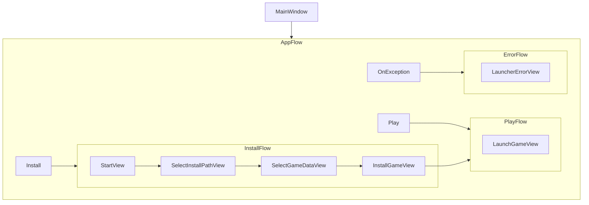

# NCO Launcher

Cross-platform UI for installing the New Construction Options game engine and required game data; also provides a game launcher.

This launcher provides an intuitive interface for installing and launching Command & Conquer games including Tiberian Dawn and Red Alert. It handles downloading game data, managing installation paths, and launching the games with appropriate configurations.

## Features

- Cross-platform support (Windows, macOS, Linux)
- Installation of Command & Conquer: Tiberian Dawn
- Installation of Command & Conquer: Red Alert
- Game launcher functionality
- Automatic download of required game assets
- Support for game expansions and patches
- Light/Dark UI mode (based on your OS setting)

## Download

This project bundles all required dependencies into one standalone app, so no additional programs are required.

You can download the launcher for your OS of choice from the release page here: https://github.com/djfdyuruiry/cnc-new-construction-options/releases/tag/latest

## Configuration

The launcher uses `config.yml` to configure game installations:

- Game data sources
- Disc image specifications
- Installation paths
- Binary configurations

A copy is saved to the user app data directory to preserve their settings.

> This file can be used to add new disc images and addons for Tiberian Dawn/Red Alert without editing the launcher source code

## Building

You will need the .NET 9.0 SDK, download it for your OS from here: https://dotnet.microsoft.com/en-us/download/dotnet/9.0

1. Build and run the launcher:
   ```bash
   dotnet build
   dotnet run
   ```
1. The launcher will automatically load configuration from `config.yml`

## Supported Platforms

This project uses the self contained .NET deployment model, which bundles all system dependencies, .NET and the launcher app into a single binary.

- Windows (x64)
- macOS (x64, arm64)
- Linux (x64)

## .NET Dependencies

- Avalonia UI Framework
  - ReactiveUI
  - AnimatedImage.Avalonia
- Autofac
- YamlDotNet
- SharpCompress
- DiscUtils
- GitHub Octokit SDK

## Project Structure

The app uses the MVVM pattern using Avalonia + ReactiveUI, with Autofac for IOC and YamlDotNet for config loading.

### UI Flow


### File Structure

- `MainWindow.axaml` - Main application window
- `App.axaml` - Avalonia App
- `Model/` - Config and UI data
- `ViewModel/` - View models for UI binding
- `View/` - UI components
- `Service/` - Services for downloading and processing game data
- `tools` - Binaries, scripts and templates specific to each supported OS

## Tools

- [`bin2iso`](https://gitlab.com/bunnylin/bin2iso) is used to convert any `.bin` disc images into `iso` format
  - Required due to the `DiscUtils` library only supporting ISO format
  - Binaries for all supported OSs are distributed with the launcher
- [`tools/runtimes/win-x64/native/create-or-update-shortcut.ps1`](`tools/runtimes/win-x64/native/create-or-update-shortcut.ps1`) is a powershell script to create Windows shortcuts
- [`tools/runtimes/linux-x64/native/nco.desktop`](tools/runtimes/linux-x64/native/nco.desktop) template for game shortcuts under Linux (GNOME/KDE etc.) - [freedesktop spec](https://specifications.freedesktop.org/desktop-entry-spec/latest/index.html#introduction) compliant
