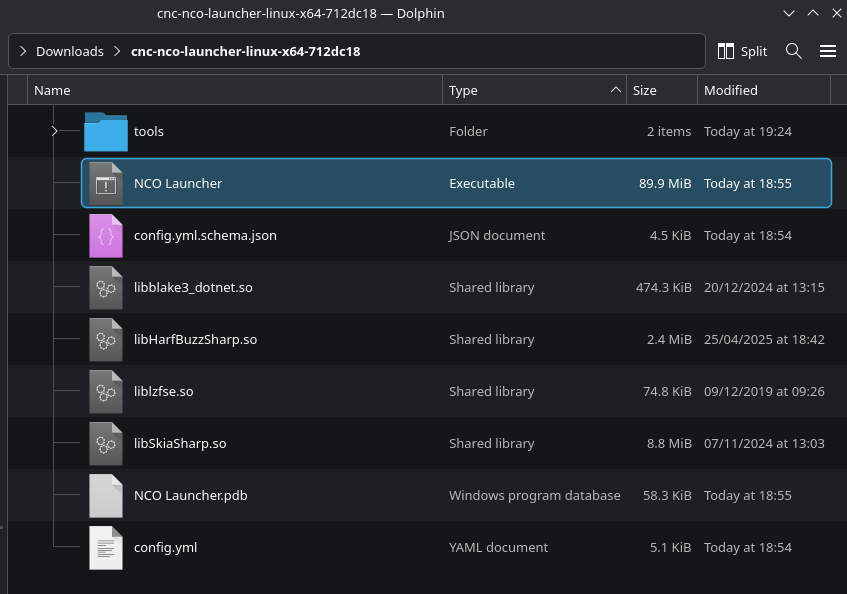
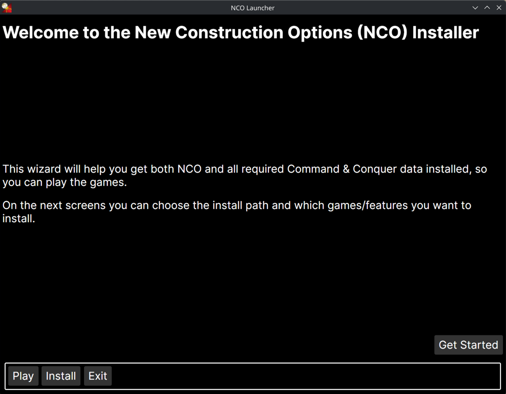
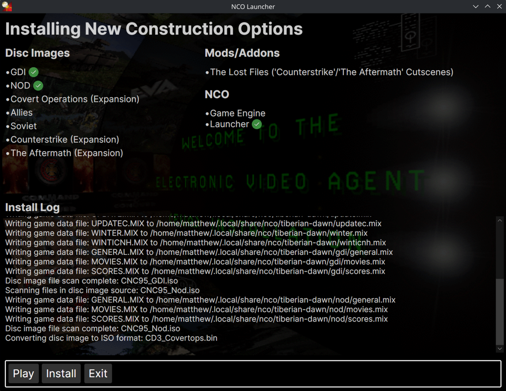
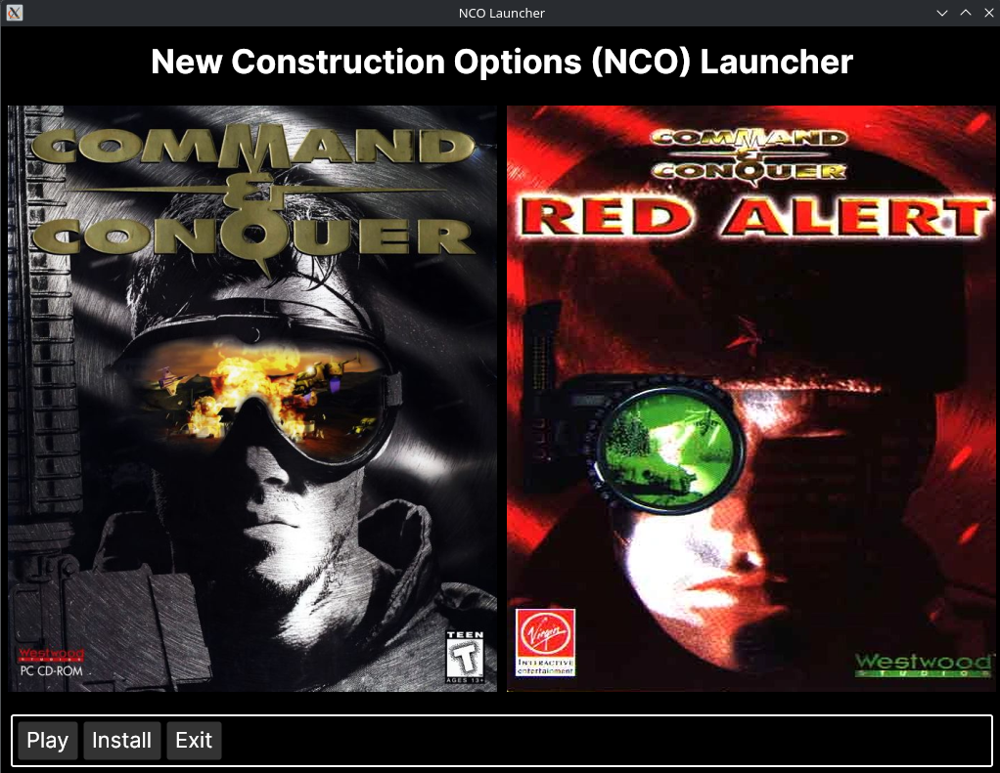
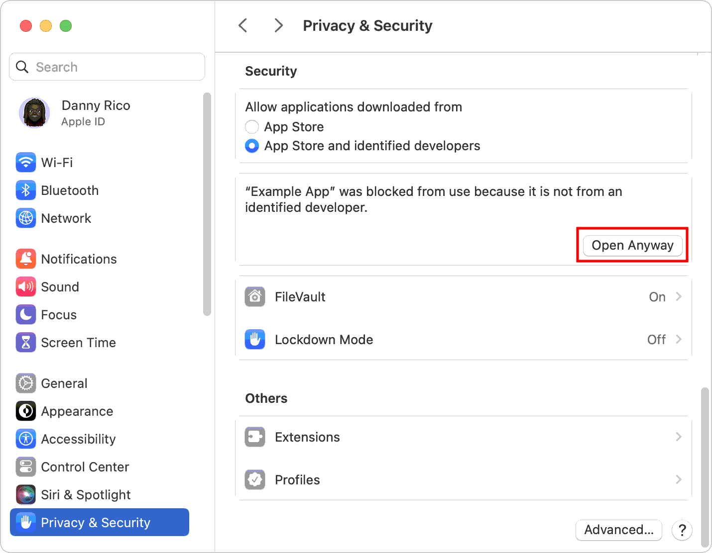

The NCO Launcher is a desktop app that will fetch all required game files and install New Construction Options on your system.

It supports Windows, Linux and macOS and installs everything for you in a couple of clicks, using data from freeware versions of Tiberian Dawn and Red Alert. Shortcuts to NCO games are added for you on Windows and Linux

- [Getting Started](#getting-started)
- [CLI Installer](#cli-installer)
- [macOS Note](#macos)

## Getting Started

> On macOS, read the section [here](#macos) first

1. Go to the rolling release for NCO [here](https://github.com/djfdyuruiry/cnc-new-construction-options/releases/tag/latest)

2. Download the NCO Launcher file that matches your Operating System

  

3. Navigate to your download using a file manager - like Windows Explorer or Finder

3. Extract all the files from the `.zip` or `.tar.gz` archive

4. Run the `NCO Launcher` file by double-clicking it



5. Go through the Installer Wizard to get everything setup





6. You will be presented with a Launcher interface once the installation is complete



7. Enjoy the games!

## CLI Installer

The Launcher also provides a CLI based installation, which can auto install everything for you without using the desktop app.

> **NOTE: CLI installation is not currently supported on macos**

### Getting Started

- Open a terminal (Use Windows Terminal/PowerShell on Windows)
  - You file browser may allow you to open a terminal in the folder you have NCO Launcher in, right click and select 'Open in Terminal' (hold shift on Windows 10)
- If needed, cd into the NCO Launcher directory by running `cd <path to lancher>`
  - If you used installed the games using the launcher previously, the default path is `~\AppData\Roaming\nco\launcher` (Windows) or `~/.local/share/nco/launcher` (Linux)
  - For example, in Windows PowerShell you can do: `cd ~\AppData\Roaming\nco\launcher`

#### Linux

- To install everything from the CLI, run:
    ```shell
      './NCO Launcher' --silent-install --install-all
    ```
- To install a single game from the CLI, run:
    ```shell
      './NCO Launcher' --silent-install --install-td # Tiberian Dawn
      './NCO Launcher' --silent-install --install-ra # OR Red Alert
    ```

#### Windows (PowerShell)

- To install everything from the CLI, run:
    ```pwsh
      & './NCO Launcher' --silent-install
    ```
- To install a single game from the CLI, run:
    ```shell
      & './NCO Launcher' --silent-install --install-td # Tiberian Dawn
      & './NCO Launcher' --silent-install --install-ra # OR Red Alert
    ```

### Options

Below is a full list of command line arguments for the launcher:

| Argument         | Description                                                                                    |
|------------------|------------------------------------------------------------------------------------------------|
| `--silent-install` | Required to run CLI installer mode                                                             |
| `--install-all`    | Install everything - game engines and data for both C&C games (Including The Lost Files patch) |
| `--install-td`     | Install Tiberian Dawn data and game engine                                            |
| `--install-ra`     | Install Red Alert data and game engine (Does NOT install The Lost Files patch)        |
| `--install-ra-tlf` | Install The Lost Files patch for Red Alert, requires `--install-ra` to also be passed          |

## macOS

Currently, the NCO Launcher and the C&C game engines are provided for macOS as `.app` bundles that appear as normal programs on your mac. These are not signed with an Apple developer account, and require some manual steps to run.

Follow the guide from Apple here if you get a warning when trying to start the launcher: https://support.apple.com/en-ie/guide/mac-help/mh40616/mac




> This currently being tracked by these two issues: https://github.com/djfdyuruiry/cnc-new-construction-options/issues/57 and https://github.com/djfdyuruiry/cnc-new-construction-options/issues/58
