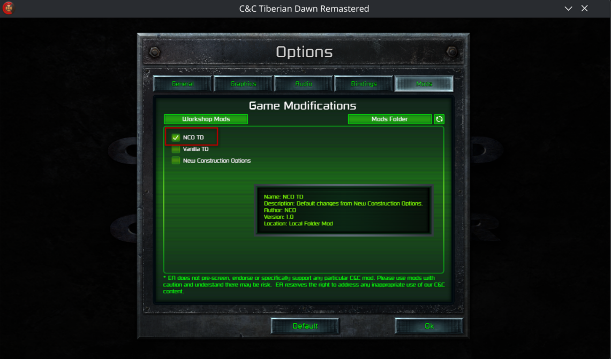

This page will help you install the New Construction Options (NCO) mod for the Command & Conquer Remastered Collection.

> Please install and run C&C: Remastered Collection at least once before installing the NCO mods

Select your operating system to begin:

- [Windows](#windows)
- [Steam Deck/Linux](#steam-deck--linux)
- [Manual Install (Windows)](#manual-install-windows)

## Windows

1. Press Windows Key + R
2. Copy and paste the below and hit enter:
    ```cmd
    powershell -ExecutionPolicy Bypass -Command "iex (iwr """"<TODO: RAW URL FOR MOD INSTALL SCRIPT>"""" | Select -ExpandProperty Content)"
    ```
3. Open C&C Remastered Collection and launch either Tiberian Dawn or Red Alert
4. Select Options on the main menu
5. Go to 'Mods'
6. Check the box beside the NCO mod (`NCO TD` or `NCO RA`)

    

## Steam Deck & Linux

**Note: These steps only work for the Steam version of C&C: Remastered Collection**
**Note: You will have to check 'Force use of a specific compatibility tool' to install C&C Remastered in Steam Deck/Linux**

> Steam Deck users should enter desktop mode first, see [here](https://help.steampowered.com/en/faqs/view/671A-4453-E8D2-323C)

1. Install protontricks, see [here](https://github.com/Matoking/protontricks?tab=readme-ov-file#installation)
2. Open a terminal
3. Paste the below and hit enter:
    ```shell
    curl -fsSL "<TODO: RAW URL FOR MOD INSTALL SCRIPT>" | bash
    ```
4. Open C&C Remastered Collection and launch either Tiberian Dawn or Red Alert
5. Select Options on the main menu
6. Go to 'Mods'
7. Check the box beside the NCO mod (`NCO TD` or `NCO RA`)

## Manual Install (Windows)

If you want to do the steps for installing the mod manually:

1. Download the Microsoft Visual C++ Redistributable from [https://aka.ms/vc14/vc_redist.x86.exe](https://aka.ms/vc14/vc_redist.x86.exe)
1. Open `VC_redist.x86.exe` and install
1. Go to the rolling release for NCO [here](https://github.com/djfdyuruiry/cnc-new-construction-options/releases/tag/latest)
1. Download `nco-td-remaster-mod-msvc` for Tiberian Dawn and `nco-ra-remaster-mod-msvc` for Red Alert
1. Press Windows Key + R
1. Type `%USERPROFILE%\Documents\CnCRemastered\Mods` and hit enter
1. Unzip `nco-td-remaster-mod-msvc` into `Tiberian_Dawn` (Create the `Tiberian_Dawn` folder if it doesn't already exist)
1. Unzip `nco-ra-remaster-mod-msvc` into `Red_Alert` (Create the `Red_Alert` folder if it doesn't already exist)
1. Open C&C Remastered Collection and launch either Tiberian Dawn or Red Alert
1. Select Options on the main menu
1. Go to 'Mods'
1. Check the box beside the NCO mod (`NCO TD` or `NCO RA`)

   
