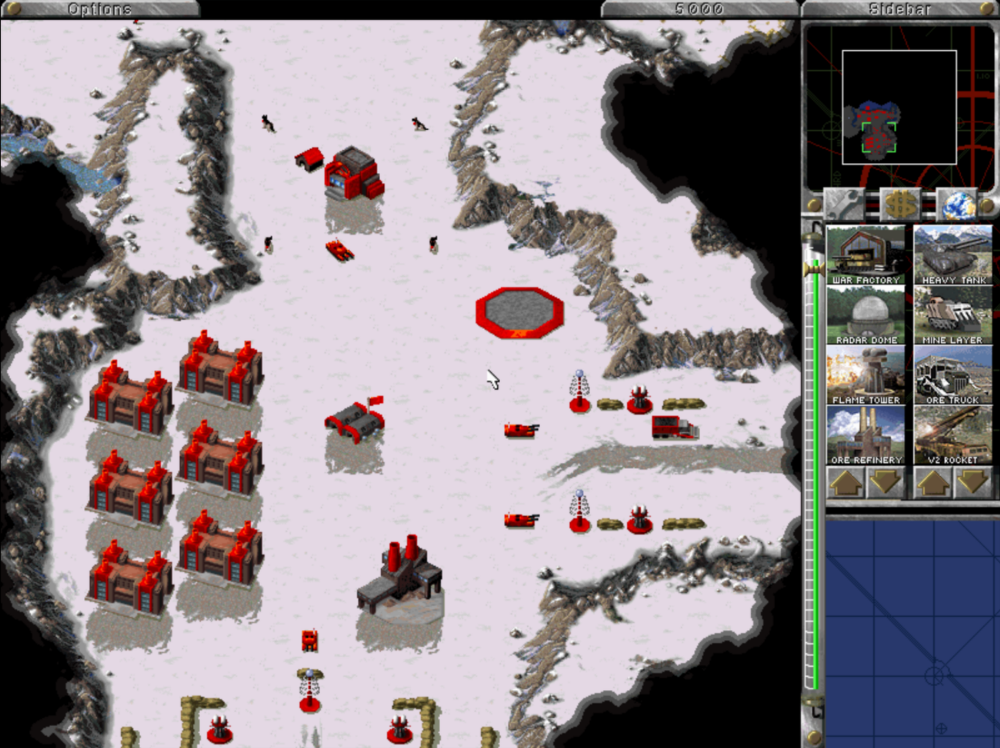
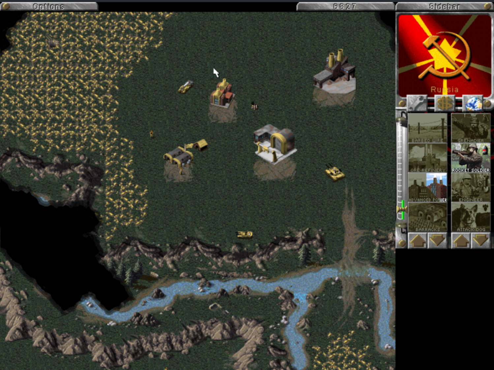

This page contains a list of all enhancements New Construction Options makes to the Command & Conquer games. 

- [Global Enhancements](#global-enhancements)
  - [High Resolution Mode](#high-resolution-mode)
- [Tiberian Dawn](2a.Tiberian-Dawn-Enhancements)
  - **Modding**
    - [Expanded Rules](2a.Tiberian-Dawn-Enhancements#expanded-rules)
    - [Scenario INI Rules](2a.Tiberian-Dawn-Enhancements#scenario-ini-rules)
    - [Lua Scripting](2a.Tiberian-Dawn-Enhancements#lua-scripting)
  - **Quality of Life**
    - [Rally Points](2a.Tiberian-Dawn-Enhancements#rally-points)
    - [A* Path Finding](2a.Tiberian-Dawn-Enhancements#a-path-finding)
	- [JSON Save Games](2a.Tiberian-Dawn-Enhancements#json-save-games)
  - **Additional Content**
    - [Unlock Music](2a.Tiberian-Dawn-Enhancements#unlock-music)
    - [PS1 & N64 Missions](2a.Tiberian-Dawn-Enhancements#ps1--n64-missions)
    - [Snow Theatre](2a.Tiberian-Dawn-Enhancements#snow-theater)
  - **Extras**
    - [Deploy/Unload Units with Keyboard](2a.Tiberian-Dawn-Enhancements#deployunload-units-with-keyboard)
    - [Scenario Editor](2a.Tiberian-Dawn-Enhancements#scenario-editor)
    - [CLI Options](2a.Tiberian-Dawn-Enhancements#cli-options)
- [Red Alert](2c.Red-Alert-Enhancements)
	- [The Lost Files](2c.Red-Alert-Enhancements#red-alert-the-lost-files)
- [Bug Fixes](2d.Bug-Fixes)
- [Technical Enhancements](2e.Technical-Enhancements)

Also See:

- [Tiberian Dawn Rules](2b.Tiberian-Dawn-Rules.md)
- [Lua Scripting Quickstart](3a.Lua-Quickstart-Guide.md)

Status key:
-  Stable version of the feature is available (no major bugs)
-  Feature available (functionality will not be complete and bugs may happen)
-  Feature in progress (very limited and is likely to be unstable)

## Global Enhancements

These enhancements work in both Tiberian Dawn and Red Alert.

### High Resolution Mode


---

The game engines have been updated to support resolutions higher than 640x400, so you can see more of the map whilst playing.

Note: NCO will start up in 800x600 mode by default.

#### Tiberian Dawn

[](img/td-hi-res-mode.png)

You can set any desired resolution in `conquer.ini` by setting the `Width` and `Height` values:

```ini
[Video]
Width=800
Height=600
StretchWidth=0
StretchHeight=0
```

**Note**: To find `conquer.ini`, follow the steps for your Operating System below:

- **Windows**: Press Windows Key + R, type `%APPDATA%\nco\tiberian-dawn` and hit enter
- **macOS**: Open Finder, choose Go > Go to Folder and enter `~/Library/Application Support/nco/tiberian-dawn`
- **Linux**: In a terminal, run `xdg-open ~/.config/nco/tiberian-dawn`

#### Red Alert

[](img/ra-hi-res-mode.png)

You can set any desired resolution in `redalert.ini` by setting the `Width` and `Height` values:

```ini
[Video]
Width=800
Height=600
StretchWidth=0
StretchHeight=0
```

**Note**: To find `redalert.ini`, follow the steps for your Operating System below:

- **Windows**: Press Windows Key + R, type `%APPDATA%\nco\red-alert` and hit enter
- **macOS**: Open Finder, choose Go > Go to Folder and enter `~/Library/Application Support/nco/red-alert`
- **Linux**: In a terminal, run `xdg-open ~/.config/nco/red-alert`


