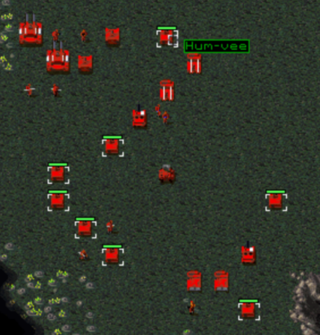
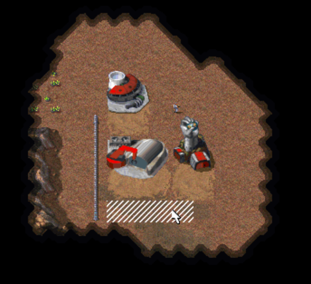
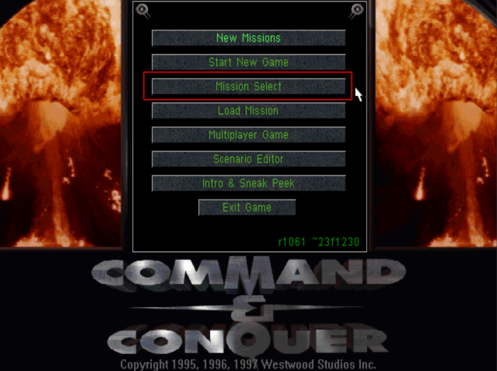
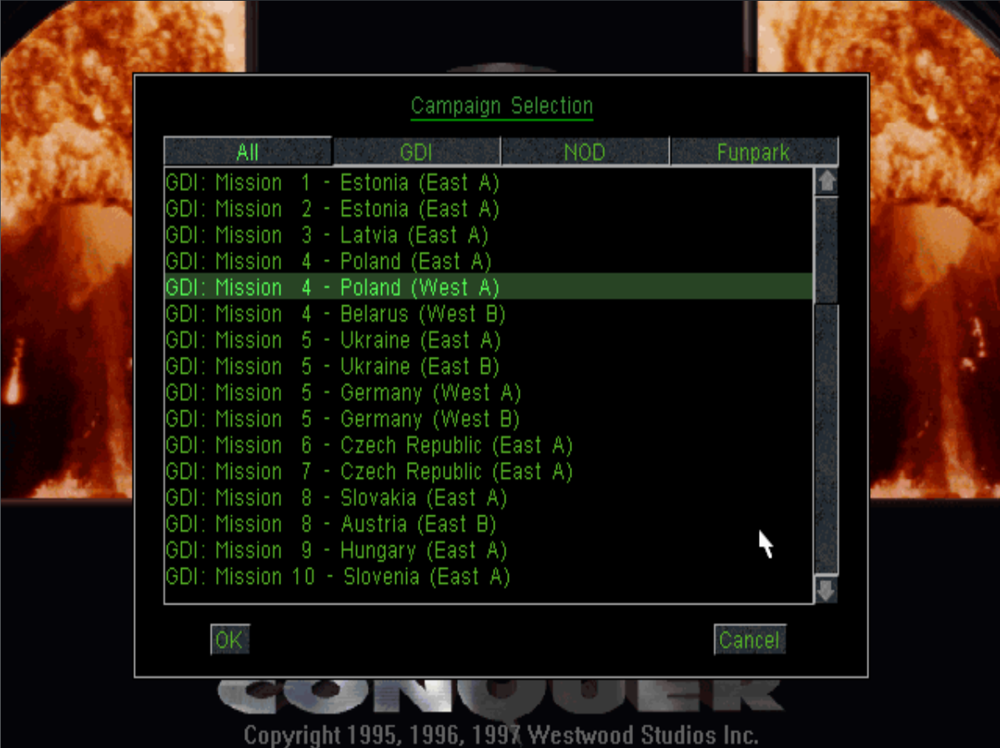

---

### Modding

- [Expanded Rules](#expanded-rules)
  - [New Infantry Rules](#new-infantry-rules)
- [Scenario INI Rules](#scenario-ini-rules)
- [Lua Scripting](#lua-scripting)

###  Quality of Life

- [Rally Points](#rally-points)
- [Deploy/Unload Units with `D` Key](#deployunload-units-with-d-key)
- [Select Same Units/Infantry/Aircraft with `T` Key](#select-same-unitsinfantryaircraft-with-t-key)
- [Modern Wall Building](#modern-wall-building)
- [Commando Guard](#command-guard-rule)
- [A* Path Finding](#a-path-finding)
- [Skirmish Save Games](#skirmish-save-games)
- [Mission Select Menu](#mission-select-menu)
- [JSON Save Games](#json-save-games)

### Additional Content

- [Unlock Music](#unlock-music)
- [PS1 & N64 Missions](#ps1--n64-missions)
- [Snow Theater](#snow-theater)

### Extras

- [Scenario Editor](#scenario-editor)
- [Mission Select Menu](#mission-select-menu)
- [CLI Options](#cli-options)

## Expanded Rules

---

More options have been added to the `rules.ini` file to control various behavior that was previously hardcoded and toggles to turn enhancements on/off.

There are also individual INI files to control Units, Infantry etc.:

- aircraft.ini
- building.ini
- infantry.ini
- unit.ini
- weapon.ini
- bullet.ini
- warhead.ini
- house.ini
- animation.ini

Full guide is here: [Tiberian Dawn Rules](2b.Tiberian-Dawn-Rules.md)

### New Infantry Rules

More rules have been added for Infantry to make behaviors that were previously hardcoded to one type generic:

- `IsImmuneToTiberium` allows any infantry to behave like a Chem Warrior and not get damaged when walking through tiberium fields
- `HasC4Charges` allows any infantry behave like a Commando and plant C4 on buildings

## Scenario INI Rules

---

Similar to Red Alert, all rules that can be changed in `rules.ini` and rules for Infantry, Units etc. can now be overridden in the INI
file for a single scenario.

See: [Scenario INI](2b.Tiberian-Dawn-Rules.md#scenario-ini)

## Lua Scripting

NCO provides the ability to load scripts to control game behavior. This builds on top of the current scenario INI files, used to make custom maps and missions.

The scripts are implemented in [Lua](https://www.lua.org/about.html), a programming language popular with video game engines due to it being lightweight and having simple syntax.

There are a set of Lua APIs available that allow interacting with the game engine.

- Run scripts for specific missions
- Access a Lua Console in-game by pressing F1 (_Not available in Remastered Mod_)
- Add/delete triggers (timer, player enters area, building destroyed etc.)
- Add new team types (reinforcements OR groups the AI player builds)
- Access data about the current scenario (player house, name, triggers etc.)
- Edit game rules (based on rules.ini options)
- Edit rules for Infantry, Units, Buildings etc. (based on INI file options)

A quickstart guide is here: [Scenario Lua Script Guide](3a.Lua-Quickstart-Guide.md)

Full documentation: [Lua API reference](3c.Lua-API-Reference.md)

## Rally Points

---

Implements rally points for Barracks, Hand of Nod, Weapons Factory etc. similar to Tiberian Sun/Red Alert 2.

This enhancement is on by default, but can be toggled off using rules.ini, see the `RallyPoints` rule in the [[Enhancements] section](2b.Tiberian-Dawn-Rules.md#enhancements).

> Code for this feature was inspired by the [CFE Patch](https://bitbucket.org/cfehunter/cncremastered/src)

## Deploy/Unload Units with D Key

---

> **NOTE: Not available in the Remaster Mod**

MCVs can now be deployed and APCs/Transports unloaded by selecting unit(s) and pressing the `D` key.

## Select Same Units/Infantry/Aircraft with T Key

---

> **NOTE: Not available in the Remaster Mod**
> 
All units/infantry/aircraft of the same type on the screen can now be selected by clicking a unit and pressing the `T` key.

This is the same behavior as seen in later C&C games.

## Modern Wall Building

---

You can now place multiple wall pieces at once in a straight line, similar to later C&C games. All wall pieces must be with a valid 
distance of existing structures and matching walls.

To ensure balance, when this enhancement is enabled you can't place buildings beside far away walls.

This enhancement is on by default, but can be toggled off using rules.ini, see the `ModernWalls` rule in the [[Enhancements] section](2b.Tiberian-Dawn-Rules.md#enhancements).

- The max length of a wall section can be changed using the rule `[Enhancements] -> ModernWallsMaxLength`
- By default, the wall pieces are at full cost. This can be changed in the `[Enhancements] -> ModernWallsFullCost` rule
- To allow placing buildings beside walls, change the `[Enhancements] -> ModernWallsAllowBuildings` rule
- This enhancement respects the rule `[Enhancements] -> MaxBuildDistance` for placing single wall pieces

> This feature was ported from the [CFE Patch](https://bitbucket.org/cfehunter/cncremastered/src)

## Command Guard Rule

---

Any unit equipped with a Rifle (`RIFLE` weapon) can now be put on area guard duty. Originally commandos were prevented 
from being used in this way.

This enhancement is on by default, but can be toggled off using rules.ini, see the `CommandoGuard` rule in the [[Enhancements] section](2b.Tiberian-Dawn-Rules.md#enhancements).

> This feature was inspired by the [CFE Patch](https://bitbucket.org/cfehunter/cncremastered/src)

## A* Path Finding

---

The original game engine uses a somewhat clunky algorithm for moving units from point A to B, moving around obstacles like ridges, walls and trees. Often units will not do what you would expect, for example going towards a ridge then round it rather than just going round it immediately.

The A* path finding feature fixes these issues, making unit movement more efficient and direct. 

**Note: This affects both human and AI players, so AI units in a single player mission might arrive sooner than expected or take a different route**

This enhancement is on by default, but can be toggled off using rules.ini, see the `AStarPathFinding` rule in the [[Enhancements] section](2b.Tiberian-Dawn-Rules.md#enhancements).

> Code for this feature is ported from the [CFE Patch](https://bitbucket.org/cfehunter/cncremastered/src)

## Skirmish Save Games

---

You can now save and load your Skirmish games in the standalone version of Tiberian Dawn, just like in the C&C Remastered Collection.

Save games will be shown with `(Skirmish)` when you open the load dialog from in-game or the main menu.

> **NOTE: This enhancement only works with JSON Save Games (enabled by default)**

## Mission Select Menu

---

You can now play any single player campaign mission from the main menu using the `Mission Select` option.

Similar to the Covert Operations `New Missions` menu this will automatically pick up changes to the Scenario INI files and any custom campaign missions.

*Note: Scenarios numbered 1-20 are displayed on this menu*

 

## JSON Save Games

---

A new save game file format has been created using [JSON](https://www.w3schools.com/whatis/whatis_json.asp)

- Save game files will always valid, they will work with new versions of C&C
  - *Original C&C save games were invalid if changes were made to the game engine*
- Save games are now portable between systems (Copy your Mac save to your Windows PC)
- Saves can now be edited in any text editor
- Mod friendly design: using INI names for Units, Buildings etc. rather than internal game engine values

This enhancement is on by default, but can be toggled off using rules.ini, see the `NewSaveGameFormat` rule in the [[Enhancements] section](2b.Tiberian-Dawn-Rules.md#enhancements).

*Full technical docs on the save game format can be found [here](https://github.com/djfdyuruiry/cnc-new-construction-options/blob/main/docs/saveload/1.%20JSON%20Format.md)*

## Unlock Music

---

Unlocks all music tracks that are available (in all scenarios) except the main menu music and score screen.

> Note: If a track isn't shown, it is not present in the Tiberian Dawn data files you are using.

_Similar behavior to Nyergud's C&C 1.06 patch_

## PS1 & N64 Missions

---

Included with the Tiberian Dawn game is `sc-psx-n64.mix`, which provides all the PS1 and N64 extra missions, as well as several N64 "FMVs".

Access the Scenarios via the `New Missions` option in the main menu.

> Note: This is a modified version of the files provided in Nyergud's C&C 1.06 patch, see [here](http://nyerguds.arsaneus-design.com/cnc95upd/cc95p106/patch106c_r3_en.html#toc_4) for credits of the original authors

## Snow Theater

---

Use the SNOW theater from Red Alert in Tiberian Dawn, simply use the string 'SNOW' in map INI files.

The required mix files are provided with the Tiberian Dawn game, no need to install separately.

> Note: The Snow mix files are from Nyergud's C&C 1.06 patch, see [here](http://nyerguds.arsaneus-design.com/cnc95upd/cc95p106/patch106c_r3_en.html#toc_4) for credits of the original authors

## Scenario Editor

Use the internal Scenario Editor developed by Westwood Studios when building C&C! 

Vanilla Conquer already did some cleanups in this area - the aim is to restore as much original functionality as possible, becoming a complete editor the far future.

> If you want a fully featured experience use [Mobius Map Editor](https://github.com/Nyerguds/MobiusMapEditor), or if you are feeling retro [CCMAP](https://cnc-comm.com/command-and-conquer/downloads/map-editors/ccmap)/[XCC Editor](https://cnc-comm.com/command-and-conquer/downloads/map-editors/ccmap)

**What works:**

- Accessing Editor from main menu (Select `Scenario Editor`)
- Adding units/terrain/buildings etc.
- Editing triggers
- Opening existing Scenarios
- Playing the Scenario directly from the Editor (you **must** save when prompted)
- Creating a new Scenario
- Saving Scenario to disk

**Bugs:**

- Main menu `Scenario Editor` text is hardcoded in English
- Exiting the editor closes the game
- When you load the editor, Music is loaded and player side units respond with voice lines when selected
  - Music eventually stops (unsure what triggers this)
  - Note: I kind of like this, so might work it into a feature (feels more fun/alive when editing)

## CLI Options

Show all available CLI options found in the original source code, and add new ones where appropriate. This will be an ongoing task, so it will stay in `beta`.

This also includes a 'cheat' mode, see: [Cheat Mode](2f.Cheat-Mode.md)

> Run the game with `--help` to see all available options, like this: `nco-td --help`
