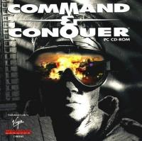
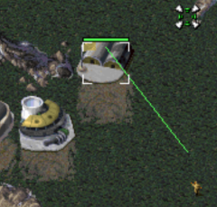
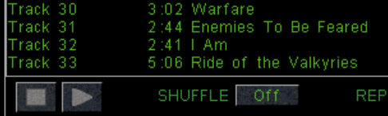
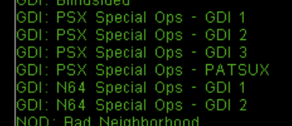
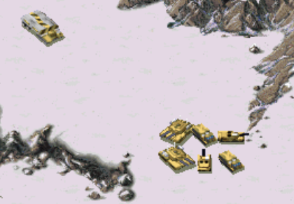

---

- [Expanded Rules](#expanded-rules)
- [Lua Scripting](#lua-scripting)
- [Scenario INI Rules](#scenario-ini-rules)
- [Rally Points](#rally-points)
- [A* Path Finding](#a-path-finding)
- [Unlock Music](#unlock-music)
- [PS1 & N64 Missions](#ps1--n64-missions)
- [Snow Theater](#snow-theater)
- [Deploy/Unload Units with Keyboard](#deployunload-units-with-keyboard)
- [CLI Options](#cli-options)
- [Scenario Editor](#scenario-editor)

## Expanded Rules

---

More options have been added to the `rules.ini` file to control various behavior that was previously fixed (hardcoded) and toggle enhancements on/off.

There are also individual INI files to control Units, Infantry etc.:

- aircraft.ini
- building.ini
- infantry.ini
- unit.ini
- weapon.ini
- bullet.ini
- warhead.ini
- house.ini
- animation.ini

Full guide is here: [Tiberian Dawn Rules](2b.Tiberian-Dawn-Rules.md)

## Lua Scripting

NCO provides the ability to load scripts to control game behavior. This builds on top of the current scenario INI files, used to make custom maps and missions.

The scripts are implemented in [Lua](https://www.lua.org/about.html), a programming language popular with video game engines due to it being lightweight and having simple syntax.

There is a set of Lua APIs available that allow interacting with the game engine.

Some highlights:

- Run scripts for specific missions
- Add/delete triggers (timer, player enters area, building destroyed etc.)
- Add new team types (reinforcements OR groups the AI player builds)
- Access data about the current scenario (player house, name, triggers etc.)
- Edit game rules (based on rules.ini options)
- Edit rules for Infantry, Units, Buildings etc. (based on INI file options)

A quickstart guide is here: [Scenario Lua Script Guide](3a.Lua-Quickstart-Guide.md)

Full documentation: [Lua API reference](3c.Lua-API-Reference.md)

## Scenario INI Rules

---

Similar to Red Alert, all rules that can be changed in `rules.ini` and rules for Infantry, Units etc. can now be overridden in the INI
file for a single scenario.

See: [Scenario INI](2b.Tiberian-Dawn-Rules.md#scenario-ini)

## Rally Points

---

Implements rally points for Barracks, Hand of Nod, Weapons Factory etc. similar to Tiberian Sun/Red Alert 2.

This enhancement is on by default, but can be toggled off using rules.ini, see the `RallyPoints` rule in the [[Enhancements] section](2b.Tiberian-Dawn-Rules.md#enhancements).

> Code for this feature is ported from the [CFE Patch](https://bitbucket.org/cfehunter/cncremastered/src)

## A* Path Finding

The original game engine uses a somewhat clunky algorithm for moving units from point A to B, moving around obstacles like ridges, walls and trees. Often units will not do what you would expect, for example going towards a ridge then round it rather than just going round it immediately.

The A* path finding feature fixes these issues, making unit movement more efficient and direct. Note that will affect both human and AI players, so AI units in a single player mission might arrive sooner than expected.

This enhancement is on by default, but can be toggled off using rules.ini, see the `AStarPathFinding` rule in the [[Enhancements] section](2b.Tiberian-Dawn-Rules.md#enhancements).

> Code for this feature is ported from the [CFE Patch](https://bitbucket.org/cfehunter/cncremastered/src)

## Unlock Music

---

Unlocks all music tracks that are available (in all scenarios) except the main menu music and score screen.

> Note: If a track isn't shown, it is not present in the Tiberian Dawn data files you are using.

_Similar behavior to Nyergud's C&C 1.06 patch_

## PS1 & N64 Missions

---

Included with the Tiberian Dawn game is `sc-psx-n64.mix`, which provides all the PS1 and N64 extra missions, as well as several N64 "FMVs".

Access the Scenarios via the `New Missions` option in the main menu.

> Note: This is a modified version of the files provided in Nyergud's C&C 1.06 patch, see [here](http://nyerguds.arsaneus-design.com/cnc95upd/cc95p106/patch106c_r3_en.html#toc_4) for credits of the original authors

## Snow Theater

---

Use the SNOW theater from Red Alert in Tiberian Dawn, simply use the string 'SNOW' in map INI files.

The required mix files are provided with the Tiberian Dawn game, no need to install separately.

> Note: The Snow mix files are from Nyergud's C&C 1.06 patch, see [here](http://nyerguds.arsaneus-design.com/cnc95upd/cc95p106/patch106c_r3_en.html#toc_4) for credits of the original authors

## Deploy/Unload Units with Keyboard

MCVs can now be deployed and APCs/Transports unloaded by selecting unit(s) and pressing the `d` key.

## CLI Options

Show all available CLI options found in the original source code, and add new ones where appropriate. This will be an ongoing task, so it will stay in `beta`.

This also includes a 'cheat' mode, see: [Cheat Mode](2f.Cheat-Mode.md)

> Run the game with `--help` to see all available options, like this: `vanillatd --help`

## Scenario Editor

Use the internal Scenario Editor developed by Westwood Studios when building C&C! 

Vanilla Conquer already did some cleanups in this area - the aim is to restore as much original functionality as possible, not to make this a complete editor.

> If you want a fully featured experience use [Mobius Map Editor](https://github.com/Nyerguds/MobiusMapEditor), or if you are feeling retro [CCMAP](https://cnc-comm.com/command-and-conquer/downloads/map-editors/ccmap)/[XCC Editor](https://cnc-comm.com/command-and-conquer/downloads/map-editors/ccmap)

**What works:**

- Accessing Editor from main menu (Select `Edit`)
- Adding units/terrain/buildings etc.
- Editing triggers
- Opening existing Scenarios
- Playing the Scenario directly from the Editor (you **must** save when prompted)
- Creating a new Scenario
- Saving Scenario to disk

**Bugs:**

- Crashes when you attempt to exit the editor
- When you load the editor, Music is loaded and player side units respond with voice lines when selected
  - Music eventually stops (unsure what triggers this)
  - Note: I kind of like this, so might work it into a feature (feels more fun/alive when editing)
