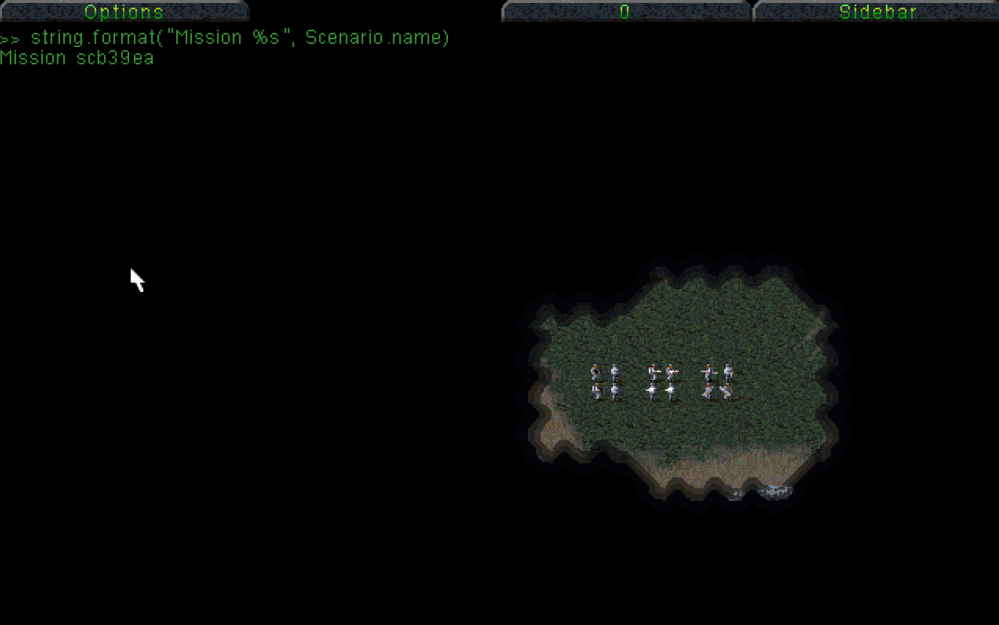

This guide explains how to write scripts for NCO Command & Conquer games using Lua. 

Scripts customize gameplay and are loaded by the game engine when missions start.

**Note: Only Tiberian Dawn is supported right now**

## Table of Contents

1. [Before you Start](#before-you-start)
2. [Background: How The Game Loads Scripts](#background-how-the-game-loads-scripts)
3. [Example 1: Rules, Types and Reinforcements](#example-1-rules-types-and-reinforcements)
4. [Breaking it Down](#breaking-it-down)
5. [Example 2: Lua Events](#example-2-lua-events)
6. [Breaking it Down (again)](#breaking-it-down-again)
7. [Debugging](#debugging)
8. [In-Game Console](#in-game-lua-console)
9. [Writing Logs](#writing-logs)
10. [Next Steps](#next-steps)

## Before you Start

This guide is designed for people of all abilities, if you have never written a game script before that is OK. Simply follow along step by step and use the external links at the end to learn more about scripting and Lua.

You should use a text editor to write scripts, the simplest option is to use Notepad if you are on Windows.

Simply typing 'text editor' into the system search on most other operating systems will give you a similar app.

## Background: How The Game Loads Scripts

When you start a mission, the engine looks for these files in a specific order:

1. A generic hook script: `on-scenario-load.lua`
2. Faction-specific scenario scripts - `gdi-scenario.lua` / `nod-scenario.lua`
3. House-specific scenario scripts - e.x. `goodguy-scenario.lua`
4. Scenario-specific files (matching scenario INI name) - e.x. `scg01ea.lua`

> Script file names should always be in lower case if you are running on a non-windows machine (Linux, Mac etc.)

Lua scripts should be placed in the `lua` folder - either inside the user folder or where Tiberian Dawn is installed. 

### Finding the Lua Folder

It is recommended to place any custom scripts in the NCO user folder. This is a folder for your user account that holds 
settings and rules for Command & Conquer games.  

Follow the steps for your Operating System below:

- **Windows**: Press Windows Key + R, type `%APPDATA%\nco\tiberian-dawn\lua` and hit enter
- **macOS**: Open Finder, choose Go > Go to Folder and enter `~/Library/Application Support/nco/tiberian-dawn/lua`
- **Linux**: In a terminal, run `xdg-open ~/.config/nco/tiberian-dawn/lua`

## Example 1: Rules, Types and Reinforcements

Let's create a script file for GDI Mission 1. This script will give GDI more reinforcements, make the MVC re-deployable and give Minigunners flamethrowers.

- Open your text editor
- Paste in the below block of code:
```lua
-- let user unpack construction yard into MCV
Rules["Game.Misc"].McvRedeployable = true

-- change minigunner (E1) to have a flamethrower
Types.Infantry.E1.Primary = "FLAMETHROWER"

-- create a new team type 'LUA1' for GDI: 1 Mammoth Tank in a Hover Craft
Scenario.teams.LUA1 = "GoodGuy,0,0,0,0,0,7,3,0,0,2,HTNK:1,LST:1,0,1,1"

-- After 8 seconds, send in the 'LUA1' team as reinforcements for GDI
Scenario.triggers.TMR4 = "Time,Reinforce.,8,GoodGuy,LUA1,0"
```
- Save your script:
  - In your editor go to file -> save (or similar)
  - Using the file save dialog, navigate to the folder where you installed the New Construction Options (NCO) game
  - Open the `lua` folder
  - Ensure the file extension in the dialog is set to 'all files' (not `*.txt`)
  - Name your file `scg01ea.lua`
- Run NCO Tiberian Dawn
- Start the main campaign as GDI
- Your Mammoth tank should arrive 8 seconds into the mission
- Once you deploy your MCV, select the Construction Yard and click nearby terrain, it will unpack into an MCV

### Breaking it Down

**Script Name**

The name of our script `scg01ea.lua` directly matches the name of the scenario INI file (`scg01ea.ini`) for our mission: Goodguy Scenario 1, East.

You can use this to add a script to any mission based on it's INI name, which is shown in the options menu when you pause a mission.

**Rules**

The `Rules` object in the script allows you to get and set the same rules as are found in `rules.ini` dynamically.

Section being loaded is `Game.Misc` and the rule being written is `McvRedeployable`, with a value of `true`.

This is equivalent to setting the below in `rules.ini` before running the game:

```ini
[Game.Misc]
McvRedeployable=yes
```

See full guide for all available rule sections and names: [Tiberian Dawn Rules](2b.Tiberian-Dawn-Rules.md)

> Note: Changes made in scripts are not permanent, nothing is saved to `rules.ini`

> Note: for `yes`/`no` rules in the INI you must use `true`/`false` in Lua

**Types**

The `Types.Infantry` object in the script allows you to get and set properties for infantry types (as are found in `infantry.ini` file) dynamically.

The type being changed is `E1` and the property being edited is `Primary`, with a value of `FLAMETHROWER`.

This is equivalent to setting the below in `infantry.ini` before running the game:

```ini
[E1]
Primary=FLAMETHROWER
```

See full guide for all available game types: [Tiberian Dawn Rules](2b.Tiberian-Dawn-Rules.md)

> Note: Changes made in scripts are not permanent, nothing is saved to `infantry.ini`

> Note: for `yes`/`no` rules in the INI you must use `true`/`false` in Lua

**Scenario**

The `Scenario` object in the script holds information about the current mission and allows you to control Teams and Triggers.

**Scenario.teams**

Team types are groups of units that can used to either reinforce for a given side or as a group the AI will build automatically. If the last unit in the group is a transport (APC, Chinook, Hover Craft) then all other units will be inside it; for example 5 grenadiers inside an APC

The names of units and infantry correspond to those found in scenario INI files.

The definition above uses the original syntax found in scenario INI files:

```ini
[TeamTypes]
GDIR2=GoodGuy,0,0,0,0,0,7,3,0,0,2,JEEP:1,LST:1,0,1,1
NOD1=BadGuy,1,0,0,0,0,20,1,0,0,1,E1:2,4,Move:0,Move:1,Move:2,Attack Units:6,0,0
```

**Scenario.triggers**

Triggers tell the game to watch for certain conditions to be true, then to preform an action. Again, the syntax shown is the same as triggers from scenario INI files:

```ini
[Triggers]
RNF4=Time,Reinforce.,10,GoodGuy,GDIR2,0
RFN2=Time,Reinforce.,6,GoodGuy,GDIR1,0
```

---

> If you want to learn more about the team types and trigger syntax shown in this example, there is an excellent guide to Scenario INI files made by Nyerguds here: [Tiberian Dawn Mission Manual](https://cnc.fandom.com/wiki/Tiberian_Dawn_Mission_Manual)


## Example 2: Lua Events

Open the `scg01ea.lua` file from Example 1 in a text editor and add the following code at the end:

```lua
Event.handlers.myLuaEvent = function(triggerName)
  -- show an on-screen message to the player
  Messages.sendToPlayer("Hello from Lua! I was called by trigger " .. triggerName)
end

Scenario.triggers.TMR3 = "Time,Lua Event,5,GoodGuy,myLuaEvent,0"
```

- Save the file in your editor
- Start NCO Tiberian Dawn
- Start the main campaign as GDI
- You will see the message printed in the top left of your screen after 5 seconds

### Breaking it Down (again)

The below code defines a new 'event' that the game engine can call:

```lua
Event.handlers.myLuaEvent = function(triggerName)
  -- show an on-screen message to the player
  Messages.sendToPlayer("Hello from Lua! I was called by trigger " .. triggerName)
end
```

It uses a Lua `function` to declare a handler, which controls what happens when the event is called. The name of the handler is `myLuaEvent`. A `triggerName` parameter to the handler contains the name of the Trigger that called the event (in this case `TMR3`). We defined our trigger using the code:

```lua
Scenario.triggers.TMR3 = "Time,Lua Event,5,GoodGuy,myLuaEvent,0"
```

The type of the trigger is `Lua Event`, which means you want the game trigger to call a Lua event when it activates; also note the name of our event (`myLuaEvent`) in the definition of the trigger.

## In-Game Lua Console

- When playing the game you can press F1 to enter Lua Console mode - this allows you to enter a line of Lua Code and run it immediately by pressing enter.
- You can use the UP and DOWN keys to scroll through the console history.
- Any statement or function can be evaluated, so this is useful to debug and test out snippets of code in-game



## Debugging

If you create a script, but it does not appear to work as you expect, you can look at the logs of the game. Logs are a text file the game creates to output information and errors as it runs.

In the same directory as NCO is installed, you will find the `nco.log` file. Open this in a text editor and scan through the entries to find any errors.

For example, if I had a syntax error (invalid code):

```lua
  -- line 54
  triggerLooku3`ps()
```

I would see the following messages in `nco.log`:

```json
{ "time": "2025-09-15T21:07:36.655698+01:00", "name": "ScenarioLua", "level": "error", "at": "nco/tiberiandawn/lua/scenariolua.h:236", "in": "auto ScenarioLua::Exec_Scenario_Lua_Scripts(const CCINIClass &, ScenarioClass &, const std::string &, const std::string &, const std::string &)::(anonymous class)::operator()(auto &) const [r:auto = const LuaResult]", "process": 771303, "thread": 771303, "message": "Failed to load scenario script 'scg01ea.lua' due to an error: /home/Games/cnc-tiberian-dawn/lua/scg01ea.lua:54: syntax error near '`'" }
```

Note the `"message"` at the bottom, which points out the line in the file and the error.

> TIP: Enable word wrap in your text editor if you can't see any `"message"` entries

> TIP: Often it is easiest to search for the script file name to find the error, e.x. `scg01ea.lua`

### Writing Logs

You can write your own logs in scripts you create to help with the debugging process:

```lua
Logger.info("Custom log message")
```

## Next Steps

- See the [3b.Lua-Advanced-Guide.md](3b.Lua-Advanced-Guide.md) for more advanced script guides and development help
- View the [3c.Lua-API-Reference.md](3c.Lua-API-Reference.md) for all API functions available
- Look at the full test script in the GitHub repository to explore more: [scg01ea.lua](https://github.com/djfdyuruiry/cnc-new-construction-options/blob/main/resources/test/td/lua/scg01ea.lua)
- If you want to learn Lua programming, see: https://www.lua.org/pil/1.html (many other guides are available online/on YouTube etc.)
  - Using an online interpreter allows you to follow along without installing Lua on your system, simply paste in your code and hit run - see: https://onecompiler.com/lua (_Note: Game scrips won't work here, just normal Lua code_)
