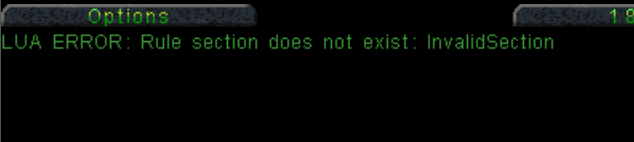

This page contains advanced topics for New Construction Options (NCO) Lua scripts.

Please look at the [Lua Quickstart Guide](3a-Lua-Quickstart-Guide.md) first as this page does not repeat any of the info there.

## Table of Contents

1. [Error Handling](#error-handling)
1. [Logging](#logging)
1. [Working with Files](#working-with-files)
1. [__debug.lua](#__debuglua)
1. [Test Lua Outside the Game](#test-lua-outside-the-game)
1. [LuaRocks Package](#luarocks-package)

## Error handling

It is good practice to ensure your script handles any errors, this also makes developing scripts less frustrating.

Let's take this script:

```lua
-- this will error as InvalidSection is not in rules.ini
Rules.InvalidSection.McvRedeployable = true
```

If we take our code and place it in a Lua function:

```lua
local function main()
  -- let user unpack construction yard into MCV
  Rules.InvalidSection.McvRedeployable = true
end

main()
```

We can now introduce error handling so if anything goes wrong in `main`, we can know about it:

```lua
local function main()
  Rules.InvalidSection.McvRedeployable = true
end

local status, error = pcall(main)

if not status then
  -- show the error to the player
  Messages.sendToPlayer("LUA ERROR: %s", error)

  -- log for debugging later
  Logger.error("LUA ERROR: %s", error)
end
```

Now if we use this as a script for a mission we will get the following message at the start:



## Logging

The `Logging` object is available to scripts, this contains functions that are used to write messages to the `nco.log` file and the terminal (if you started the game from a terminal - PowerShell, Bash etc.)

```lua
Logger.error("Something bad happened")

Logger.info("Some useful info")

Logger.debug("Debugging info")
```

You can use `string.format` style calls to format the string you pass the Logger. For more info, see: https://www.codecademy.com/resources/docs/lua/strings/format

```lua
local someNumber = 12
local aString = "text"

Logger.info("I got the number %d and a string '%s'", someNumber, aString)
```

This will print the following message:

```
I got the number 12 and a string 'text'
```

### Levels

By default the game only writes out `info`, `warning` and `error` messages. This is to prevent tons of debug info cluttering the logs.

To enable debug logging in your script:

```lua
Logger.setLevel("debug")

-- now this will work
Logger.debug("Hello from debugging")
```

## Working with Files

The `System` object provides the ability to access files from various locations as needed. This uses an interface similar to `io.open`:

```lua
-- open conquer.ini
local conquerIni, fileError = System.openGameFile("conquer.ini")

if conquerIni then
  for line in conquerIni:lines() do
    -- print each line found in conquer.ini
    print(line)
  end

  -- cleanup
  conquerIni:close()
else
  Logger.error("Error opening file: %s", fileError)
end
```

- `System.openGameFile` looks for files in the folder where the game is installed.

- `System.openUserFile` looks for files in the user directory:
  - `<HOME>\AppData\Roaming\nco` (windows)
  - `${HOME}/.config/nco` (linux)
  - Mac OSX uses `${HOME}/Library/Application Support/nco`

You can also use this function to write out a file:

```lua
-- open my-data.txt
local myData, fileError = System.openGameFile("my-data.txt", "w")

if myData then
  myData:write("some useful data")

  -- cleanup
  myData:close()
else
  Logger.error("Error opening file: %s", fileError)
end
```

> Remember file names are case sensitive on non-windows systems, so try to respect that when writing scripts

> There is a good guide for reading and writing files in Lua here: https://www.family-historian.co.uk/help/fh7-plugins/lua/readingandwritingfiles.html

## __debug.lua

If you create a `__debug.lua` file inside the `lua` folder of yor NCO game installation, it can be executed on demand whilst playing a mission. This is useful to test out new pieces of code or just figure out why something doesn't work.

You need to start the game in 'cheat' mode to enable this:

  - In the game folder, find `vanillatd-cheats` and run it instead of the main game
    - This might be `vanillatd-cheats.bat` or `vanillatd-cheats.sh` depending on your OS
  - When in a mission you can press `F5` to trigger the debug lua script
  - View the `nco.log` file in the game folder to see if any errors occurred
  - The script is reloaded every time you press `F5`, so you can edit while the game is running

## Test Lua Outside the Game

> This is only available to Windows and Linux users, macos releases don't include this feature

For more complex scripts you might want to test the script outside of the game. NCO includes a Lua interpreter with the game, in the `lua` folder
you will find `lua` (or `lua.exe` on Windows).

> This uses a mock version of the game Lua API - so nothing will 'happen' when you run your script but it will validate your calls are correct.

Guide to testing your scripts with the interpreter:

- Open a terminal (you can use PowerShell on Windows)
- Run `cd <path-to-nco>` replacing `<path-to-nco>` with the full path to where you installed NCO Tiberian Dawn
  - If you used installed the game using the launcher, the default path is `~\AppData\Roaming\nco\tiberian-dawn` (Windows) or `~/.local/share/nco/tiberian-dawn` (Linux)
    - For example, on windows you would do: `cd ~\AppData\Roaming\nco\tiberian-dawn`
  - If you are using the Remastered mod use: `cd ~\Documents\CnCRemastered\Mods\Tiberian_Dawn\NCO_TD\Data`
- Run `cd lua`
- In a text editor, add the following two lines to the top of the script you want to test:

  ```lua
  -- IMPORTANT: delete the two lines below after testing (otherwise your code will always use a mock)
  require("nco.TiberianDawn.lib.TdCncApiMock")
  require("nco.TiberianDawn")
  ```

- On Windows - run:

  ```shell
  $env:LUA_PATH = "$($env:APPDATA)/nco/tiberian-dawn/lua/?.lua;$($env:APPDATA)/nco/tiberian-dawn/lua/?/init.lua"
  $env:LUA_PATH += ";$(Get-Location)/?.lua;$(Get-Location)/?/init.lua"
  lua "$($env:APPDATA)/nco/tiberian-dawn/lua/my-script.lua"
  ```

  > **replace 'my-script.lua' with the name of your script file**

- On Linux - run:

  ```shell
  export LUA_PATH="${HOME}/.config/nco/tiberian-dawn/lua/?.lua;${HOME}/.config/nco/tiberian-dawn/lua/?/init.lua"
  export LUA_PATH="${LUA_PATH};$(Get-Location)/?.lua;$(Get-Location)/?/init.lua"
  lua "${HOME}/.config/nco/tiberian-dawn/my-script.lua"
  ```

  > **replace 'my-script.lua' with the name of your script file**

## LuaRocks Package

- LuaRocks is a package manager for the Lua programming language, similar to npm for Node.js or pip for Python.
- This repo publishes the `cnc-nco` package to [luarocks.org](https://luarocks.org) here: https://luarocks.org/modules/djfdyuruiry/cnc-nco
- This package contains the same Lua Library as you will find in the game engine.

Below is a guide for using this package to develop and test game scripts:

- Install LuaRocks: https://github.com/luarocks/luarocks/blob/main/docs/download.md
- Ensure LuaRocks is in your PATH
- Open a terminal (use Git Bash on Windows)
- Install the package: `luarocks --local install --server=https://luarocks.org/dev cnc-nco`
- You can now execute your scripts and code using Lua:
  ```shell
  eval "$(luarocks path)"
  lua my-nco-script.lua
  ```

> To update the `cnc-nco` package in the future, run: `luarocks --local install --server=https://luarocks.org/dev --force cnc-nco`
