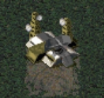

---

The main target is the standalone `Tiberian Dawn` engine, with a view to copy enhancements over to `Red Alert` when it makes sense.

It also supports the Remastered collection as two mods, one for Tiberian Dawn and the other for Red Alert.

My vision for `Tiberian Dawn`:

- Users can mod their C&C experience without modifying C++ code
- Tweaks and enhancements are immersive, they surface in game as UI menus
- Low level control is available for nearly all aspects of the game engine via config files
  - Anything currently stored in source code, binary files, hidden in MIX files etc. should be made available in plain text format
- Static limits imposed by the original source code are removed (no cap on Unit types, Music tracks etc.)
- Combine the best of old tools and engine changes to give modders the ability to make as many changes as possible
- Patches from `Vanilla Conquer` and Nyergud's Patch Project are synced in when possible

For more info on the Project background see: [Why This Exists](9a.Why-This-Exists)
